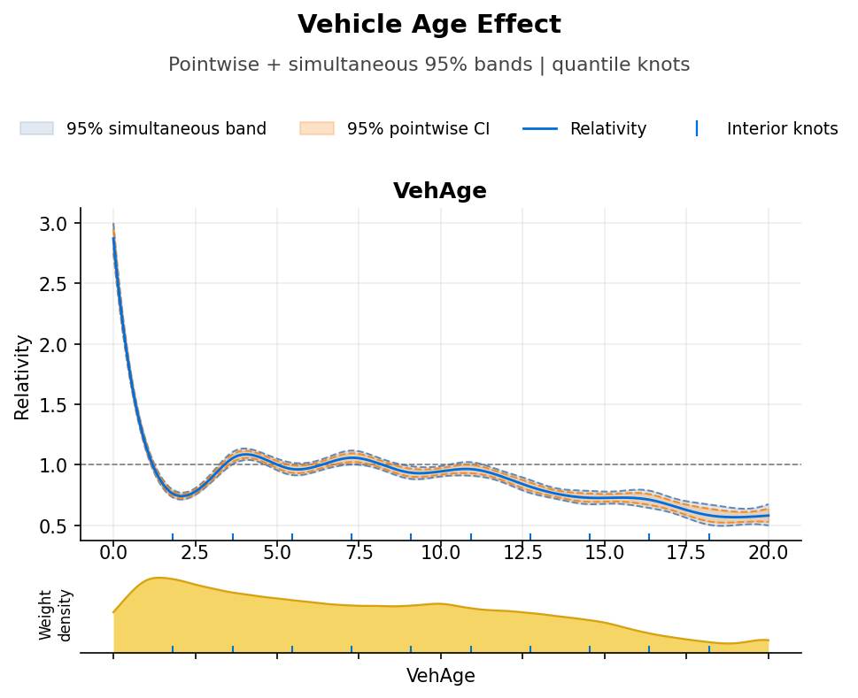
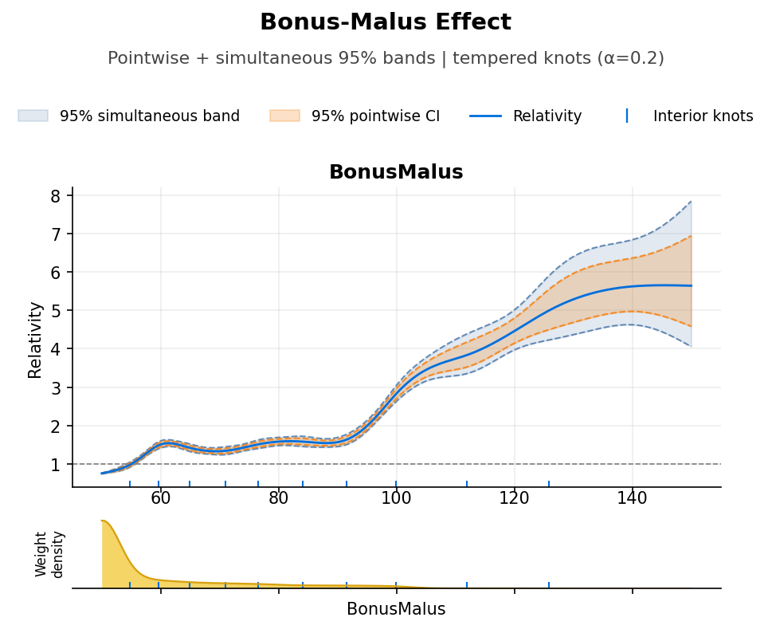

# SuperGLM

[](https://github.com/StrudelDoodleS/superglm/actions/workflows/ci.yml)
[](https://codecov.io/github/StrudelDoodleS/superglm)
[](https://github.com/StrudelDoodleS/superglm/actions/workflows/ci.yml)

Penalised GLMs for insurance pricing. SuperGLM supports standard penalised fits, exact REML, large-`n` discrete/fREML-style REML, spline double-penalty shrinkage, group penalties, interactions, and statsmodels-style summaries for Poisson, Gamma, NB2, and Tweedie models.

## Installation

```bash
pip install git+https://github.com/StrudelDoodleS/superglm.git
```

With optional dependencies:

```bash
pip install "superglm[sklearn] @ git+https://github.com/StrudelDoodleS/superglm.git"
pip install "superglm[all] @ git+https://github.com/StrudelDoodleS/superglm.git"
```

## Quick start

**Auto-detect mode** — list which columns should be splines, the rest is auto-detected:

```python
from superglm import SuperGLM

model = SuperGLM(
    family="poisson",
    penalty="group_lasso",
    lambda1=0.01,
    splines=["DrivAge", "VehAge", "BonusMalus"],
    n_knots=10,
)
model.fit(df, y, sample_weight=exposure)
predictions = model.predict(df)
```

**Explicit mode** — full control over each feature:

```python
from superglm import SuperGLM, Spline, Categorical, Numeric

model = SuperGLM(
    family="poisson",
    penalty="group_lasso",
    lambda1=0.01,
    features={
        "DrivAge": Spline(kind="bs", k=14),
        "VehAge": Spline(kind="cr", k=10),
        "BonusMalus": Spline(kind="ns", k=10),
        "Area": Categorical(base="most_exposed"),
        "LogDensity": Numeric(),
    },
)
model.fit(df, y, sample_weight=exposure)
```

## Weights and offsets

Public examples use `sample_weight=`. In insurance settings this is interpreted as **exposure / frequency weight**, not inverse-variance weight. The older `exposure=` keyword is still accepted as a backward-compatible alias.

Two common patterns for count models:

```python
# Raw count target: offset absorbs exposure, model estimates a rate
model.fit(df, claim_counts, offset=np.log(exposure))

# Rate target (count / exposure): weight by exposure for heteroscedasticity
model.fit(df, claim_rate, sample_weight=exposure)
```

## Fitting modes

**1. Standard penalised fit**

Use `fit()` when you want a fixed `lambda2` and a standard regularised GLM fit.

```python
model = SuperGLM(
    family="poisson",
    penalty="group_elastic_net",
    lambda1=0.01,
    lambda2=0.1,
    features=features,
)
model.fit(df, y, sample_weight=exposure)
```

**2. Exact REML**

Use `fit_reml(discrete=False)` for the standard smoothness-selection path (`lambda1=0`).

```python
model = SuperGLM(family="poisson", lambda1=0.0, features=features)
model.fit_reml(df, y, sample_weight=exposure, max_reml_iter=30)
```

**3. Discrete / fREML-style REML**

Use `fit_reml(discrete=True)` for large data. This is the fast path for spline-heavy frequency models.

```python
model = SuperGLM(
    family="poisson",
    lambda1=0.0,
    discrete=True,
    n_bins=256,
    features=features,
)
model.fit_reml(df, y, sample_weight=exposure, max_reml_iter=30)
```

**4. Shrinkage vs selection**

- `select=True` on a spline adds mgcv-style double-penalty shrinkage.
- `lambda1 > 0` activates sparse/group penalties.

Those are different tools:

- `select=True` is the more REML-aligned way to let smooth terms shrink toward zero.
- `lambda1 > 0` is the sparse-additive path, best used for screening / compression rather than mgcv-style inference.

## Feature types

### Splines

`Spline(kind, k)` is the recommended API for creating spline features. `kind` selects the basis type, `k` is the basis dimension matching mgcv's `k`. You can also use `n_knots` (interior knot count) instead of `k`.

```python
Spline(kind="bs", k=14)                   # 14-column P-spline (default kind)
Spline(kind="ns", k=10)                   # 10-column natural spline (linear tails)
Spline(kind="cr", k=10)                   # 9-column cubic regression spline (k-1 after identifiability)
Spline(kind="bs", k=14, select=True)       # mgcv double penalty: spline-vs-linear selection
Spline(kind="cr", k=12, select=True)       # CR with double penalty selection
```

| Kind | Basis | Penalty | Constraints | Built cols |
|------|-------|---------|-------------|-----------|
| `"bs"` | B-spline | Second-difference | None | `k` |
| `"ns"` | B-spline | Second-difference | f''=0 at boundaries | `k` |
| `"cr"` | B-spline | Integrated f'' squared | Natural + identifiability | `k - 1` |

`k` matches mgcv's `k` for all kinds. For `"cr"`, the built column count is `k - 1` because the identifiability direction is physically removed (mgcv absorbs it via a side constraint instead).

`select=True` (BS, CR, and CR cardinal) decomposes the penalty eigenspace into a linear subgroup and a wiggly subgroup, both penalised (mgcv-style double penalty). With `fit_reml()`, REML estimates separate lambdas for each subgroup — driving a lambda to infinity effectively zeros that component. Three-way selection: nonlinear, linear, or dropped. Not supported for NS (its constrained penalty has only 1 null eigenvalue).

The concrete classes `BasisSpline`, `NaturalSpline`, and `CubicRegressionSpline` are also available for direct use.

**Polynomial** — Orthogonal polynomial (Legendre basis). Very stable across refits — ideal for features with simple monotone or quadratic shapes.

```python
Polynomial(degree=2)            # quadratic (common insurance choice)
Polynomial(degree=3)            # cubic (default)
```

**Categorical** — One-hot encoded with a reference level. The entire factor is selected or removed as a group.

```python
Categorical(base="most_exposed")  # base = highest-exposure level (default)
Categorical(base="first")         # base = alphabetically first level
Categorical(base="B")             # explicit base level
```

**Numeric** — Single continuous feature, standardised by default. Group size 1, so group lasso reduces to standard L1.

```python
Numeric()                       # standardised (default)
Numeric(standardize=False)      # raw scale
```

## Interactions

Interactions between features are specified via the `interactions` parameter. The interaction type is auto-detected from the parent feature specs.

```python
model = SuperGLM(
    features={"age": Spline(k=14), "region": Categorical()},
    interactions=[("age", "region")],
    lambda1=0.01,
)
model.fit(df, y, sample_weight=exposure)
```

Auto-detected interaction types:

| Parent types | Interaction class | Groups |
|---|---|---|
| Spline + Categorical | `SplineCategorical` | One spline group per non-base level |
| Polynomial + Categorical | `PolynomialCategorical` | One polynomial group per non-base level |
| Numeric + Categorical | `NumericCategorical` | Single group with per-level slopes |
| Categorical + Categorical | `CategoricalInteraction` | Single group with cross-level indicators |
| Numeric + Numeric | `NumericInteraction` | Single group (product term) |
| Polynomial + Polynomial | `PolynomialInteraction` | Single group (tensor product) |

## Penalties

```python
from superglm import GroupLasso, SparseGroupLasso, GroupElasticNet, Ridge, Adaptive

GroupLasso(lambda1=0.01)                          # group L2 — select/remove entire groups
SparseGroupLasso(lambda1=0.01, alpha=0.5)         # group L2 + elementwise L1
GroupElasticNet(lambda1=0.01, alpha=0.5)           # group lasso + ridge shrinkage
Ridge(lambda1=0.01)                               # L2 shrinkage, no selection
GroupLasso(lambda1=0.01, flavor=Adaptive())        # adaptive group lasso (two-stage)
```

If `lambda1=None` (default), it is auto-calibrated to 10% of `lambda_max` at fit time.

For spline-heavy models, `GroupElasticNet` is usually the smoother selection path than pure `GroupLasso`. `Ridge` is shrinkage only and does not remove terms.

## Regularisation path

Fit a sequence of models from high to low regularisation with warm starts:

```python
from superglm import PathResult

model = SuperGLM(
    family=Poisson(),
    penalty=GroupLasso(),
    features={
        "DrivAge": Spline(k=14),
        "Area": Categorical(base="most_exposed"),
    },
)
result = model.fit_path(df, y, sample_weight=exposure, n_lambda=50, lambda_ratio=1e-3)

result.lambda_seq       # (50,) decreasing lambda values
result.coef_path        # (50, p) coefficients at each lambda
result.deviance_path    # (50,) deviance at each lambda
result.n_iter_path      # (50,) PIRLS iterations per lambda
```

Or pass a custom lambda sequence:

```python
result = model.fit_path(df, y, sample_weight=exposure, lambda_seq=[1.0, 0.1, 0.01])
```

After `fit_path`, `model.predict()` uses the last (least-regularised) fit.

## Inspecting results

```python
# Statsmodels-style summary table with SEs, p-values, and smooth tests
m = model.metrics(df, y, sample_weight=exposure)
print(m.summary())

# Per-term inference (TermInference dataclass)
ti = model.term_inference("DrivAge")

# Plot a single term with CI bands and exposure density strip
model.plot_relativity("DrivAge", X=df, exposure=exposure)

# Plot all terms in a grid
model.plot_relativities(X=df, exposure=exposure, interval="both")

# Relativity DataFrames (for manual access / export)
rels = model.relativities(with_se=True)
```

### Example: single-term relativity plots

Poisson frequency model on French MTPL2 (678k policies), REML smoothness selection.
95% pointwise confidence bands with exposure-weighted density strip and interior knot positions.

| Vehicle Age (`quantile_rows` knots) | Bonus-Malus (`quantile_tempered`, α=0.2) |
|:---:|:---:|
|  |  |

## Tweedie support

Fit with a fixed Tweedie power:

```python
from superglm import Tweedie

model = SuperGLM(family=Tweedie(p=1.5), penalty=GroupLasso())
```

Or estimate the power via profile likelihood:

```python
model = SuperGLM(family="tweedie", penalty=GroupLasso(lambda1=0.01))
result = model.estimate_p(df, y, sample_weight=exposure, p_range=(1.1, 1.9))
print(result.p_hat)  # estimated Tweedie power
```

## Negative binomial (NB2) support

For overdispersed count data where the Poisson variance assumption is too restrictive:

```python
from superglm import NegativeBinomial

# Fixed theta
model = SuperGLM(family=NegativeBinomial(theta=1.0), penalty=GroupLasso(lambda1=0.01))
model.fit(df, y, sample_weight=exposure)

# Profile estimate theta (MASS-style alternating GLM fit + Newton update)
result = model.estimate_theta(df, y, sample_weight=exposure)
print(result.theta_hat)  # estimated dispersion
```

## sklearn interface

```python
from superglm import SuperGLMRegressor

model = SuperGLMRegressor(
    family="poisson",
    penalty="group_lasso",
    lambda1=0.01,
    spline_features=["DrivAge", "VehAge"],
    n_knots=10,
)
model.fit(df, y, sample_weight=exposure)
model.predict(df)
```

Feature types are auto-detected: object/category columns become `Categorical`, columns in `spline_features` become `Spline`, everything else becomes `Numeric`.

## Families

| Family | Variance function | Use case |
|--------|------------------|----------|
| `Poisson()` | V(mu) = mu | Claim frequency |
| `NegativeBinomial(theta=1.0)` | V(mu) = mu + mu^2/theta | Overdispersed frequency |
| `Gamma()` | V(mu) = mu^2 | Claim severity |
| `Tweedie(p=1.5)` | V(mu) = mu^p | Pure premium (frequency x severity) |

## How it works

SuperGLM fits penalised GLMs via PIRLS (penalised iteratively reweighted least squares) with a proximal Newton block coordinate descent inner solver. Each feature group gets its own block in the BCD cycle, and the group lasso proximal operator either keeps or zeros the entire group.

SSP (smoothing spline penalty) reparametrisation transforms the B-spline basis so that the group lasso penalty acts on coefficients that are orthogonal with respect to the smoothing penalty. This means group lasso can select smooth functions without distorting their shape.
