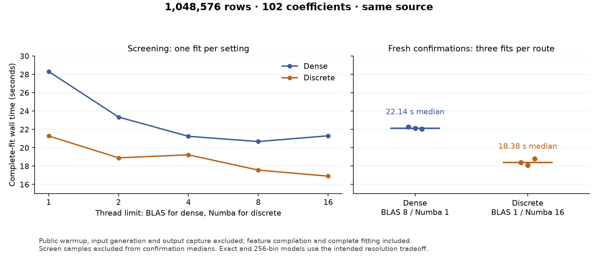

# Discrete execution performance

## Numerical review follow-up

At `41ae3960`, value screens, terminal materialization and public scoring use
geometry's slope/intercept/offset addition order. Speculative row cross-products
also use the existing exponent-range guard when histogram fallback fits its
allocation cap. Automatically admitted cancellation and signed overflow/underflow
regressions fail before the fixes; 347 surrounding tests pass afterward.

One public Gaussian fit pair compares `31380778` with `41ae3960`, using the
unchanged N=1,048,576/q102/knots4/bins256 contract and BLAS1/native16:

| Observation | Before | After |
|---|---:|---:|
| Complete fit, seconds | 14.157303 | 13.549086 |
| CPU, seconds | 70.253641 | 68.214821 |
| Fit-end process highwater, bytes | 2,008,440,832 | 1,987,522,560 |
| After output and diagnosis, bytes | 2,018,693,120 | 2,014,253,056 |
| Timed-worker public warmup, seconds | 0.843481 | 0.884251 |

Separate setup processes populate normal warmup caches before both fresh timed
workers. Feature compilation and remaining fit-specific compilation stay inside
the fit clock. Pre-fit highwater is 1,023,193,088 / 1,023,483,904 bytes. These are
single observations, not a replicated speed estimate or causal memory claim;
the 12.5-second target remains open.

Coefficients, covariance, smoothing parameters, EDF, objective, likelihood,
terminal score and curvature agree exactly, as do all captured fit and smoothing
histories. Train/holdout parameter predictions differ by at most 1.34e-15 /
8.89e-16 following the addition-order correction; these are descriptive
differences, not inferred tolerances. The stored representation is unchanged,
so this comparison measures execution arithmetic separately from binning error.
Both runs retain 16 inner iterations, seven smoothing updates and the same
`converged_uncertified` diagnosis and three findings.

The valid untimed witness matches the candidate's saved outputs exactly. It
observes 288 native calls using 16 workers, 18 complete geometry streams, 16
fused trials, two standalone likelihood streams and zero global refusals.
This workload does not enter the speculative row-cross branch; its boundary
coverage comes from the focused regressions, not the timing result. The first
witness was rejected because documentation changed during its workspace guard;
its raw records are preserved, followed by one authorized replacement under the
unchanged guards. Neither timed fit was repeated. Raw captures and their digest
summary remain under `.benchmark-artifacts/discrete-performance/numerical-review-prepared/`.
The summary SHA256 is
`2a894ed8ccb69d7f1cd4ca459fd981a835634d47ff91a1c655dfbb270d4766c1`.

## Fused first-trial evaluation

At `06e1ccff`, eligible Gaussian/Gamma chunked fits obtain a trial's likelihood
and geometry in the same stream, reusing geometry if Armijo accepts the step.
Later backtracks and unsupported contracts retain their existing evaluation.
Typed numerical refusal preserves value retry without hiding malformed inputs;
failure-only validation keeps live-source errors authoritative. Nineteen focused
regressions and independent review cover these boundaries, cancellation bounds,
weights/offsets, cleanup and small complete fits.

One fresh public million-row q102 comparison takes **14.271 seconds before and
13.086 seconds after**, an observed 8.30% reduction. Both use BLAS1/native16 and
the same complete-fit clock. All ten saved final arrays, the full final result and stored representation
agree exactly. Intermediate coefficient-fit/smoothing records differ in nine
scalar fields, with maximum absolute objective/likelihood difference 2.33e-10;
these are descriptive differences. Both finish
with 16 inner iterations and seven smoothing updates at `practical_plateau`;
`diagnose()` retains the same convergence classification and findings.

The separate witnesses reduce standalone chunked likelihood evaluations from
18 to two. Sixteen first-trial geometry evaluations replace the duplicate value
passes; one rejected coefficient trial adds geometry work, so total geometries
rise from 17 to 18. This reduces row passes without changing the asymptotic
order in N or the binned statistical model. Both witnesses match their timed
outputs exactly. Native calls rise from 272 to 288, using 16 workers with zero
global refusals or new native signatures; accepted endpoint reuse remains.
The combined scalar/geometry predictor pass count falls from 35 to 20.

Fit-end process highwater is 2,298,585,088 / 2,025,353,216 bytes; later output
highwater is 2,333,552,640 / 2,035,523,584 bytes. These are recorded observations,
not a memory-gain claim: baseline warmup compiled in its new checkout and took
33.588 seconds, versus 0.910 seconds using the candidate's existing cache.
Warmup is outside both fit clocks, but its allocations affect process highwater.
CPU time is 66.795 / 68.089 seconds. All source, helper, memory and activity
guards pass.

This is one pair, not a replicated speed estimate. The **12.5-second target
remains unmet**; the earlier repeated 15-second confirmation remains the
established milestone. Retain this bounded fix and its evidence without another
optimization or thread sweep. The tracked latency receipt preserves the full
comparison, clock boundaries and independent dispatch records.

The final dependency fix moves the unchanged exact-family predicate into the
existing likelihood helper, preserving the module dependency rules and all
admission conditions. The measurements above remain pinned to `06e1ccff`.
After that relocation, 632 surrounding solver, family, geometry and architecture
regressions pass, including 21 fused-trial/admission cases. Ruff, scoped typing,
lock/dependency checks, the smoke script and strict documentation build pass.

## Initial N-by-width complete-fit diagnostic

Eight fresh fits at `751df3db` vary rows and spline width independently, keeping
the public fragmented Gaussian fixture, 256 bins and the existing fit clock.
Dense uses BLAS8/native1; discrete uses BLAS1/native16. Each row below contains
one run per route, with matching coefficient and smoothing iteration counts.
These are diagnostic samples, not new latency confirmations.

| N | q | Dense fit (s) | Discrete fit (s) | Dense/discrete speed ratio | Inner/smoothing iterations |
| ---: | ---: | ---: | ---: | ---: | ---: |
| 262,144 | 102 | 6.783 | 5.078 | 1.34 | 18 / 7 |
| 262,144 | 222 | 11.056 | 6.161 | 1.79 | 24 / 10 |
| 1,048,576 | 102 | 21.222 | 13.512 | 1.57 | 16 / 7 |
| 1,048,576 | 222 | 44.792 | 17.474 | 2.56 | 23 / 9 |

| N | q | Dense fit-end highwater (MiB) | Discrete fit-end highwater (MiB) | Maximum holdout-parameter difference |
| ---: | ---: | ---: | ---: | ---: |
| 262,144 | 102 | 1,279.08 | 801.66 | 7.36e-4 |
| 262,144 | 222 | 1,740.75 | 849.81 | 8.99e-4 |
| 1,048,576 | 102 | 3,708.07 | 1,902.55 | 3.23e-4 |
| 1,048,576 | 222 | 5,537.95 | 2,001.17 | 6.70e-4 |

At the largest cell discrete uses 63.86% less fit-end process highwater and
is 2.56 times as fast. Increasing width from 102 to 222 coefficients increases
complete-fit time by 2.11 times for dense and 1.29 times for discrete there.
This supports the expected practical benefit of moving basis-width work out
of the observation loop. It does not isolate a fixed-iteration complexity law:
iterations change across cells, random samples at different N are not nested,
and the thread settings were screened previously at q102, not optimized anew
at every shape. All fits reach `practical_plateau`, without strict smoothing
stationarity certification. Holdout differences measure binning, not execution
error; the receipt retains all ten numerical-output comparisons.

The separate q222/N=1,048,576 witness observes 384 contiguous native calls,
zero strided calls, 16 workers and ten paired targets per batch, with
184,520,736 paired active rows, nine accepted endpoint reuses and 16 digest
thread IDs. Its ten saved arrays, full result, smoothing/coefficient-fit
records and representation exactly match the timed discrete reference.
All source/helper, pool, activity and memory guards pass. Fit-end highwater is
kept separate from later output/representation highwater throughout.

A ninth timed run tests only `OMP_WAIT_POLICY=PASSIVE` immediately after the
large q102 default discrete fit. It takes 14.300 versus 13.512 seconds, while
CPU falls from 65.033 to 24.683 seconds. All saved outputs and result records
agree exactly. Lower CPU does not supply the requested latency gain, so retain
the default waiting policy. This campaign explicitly clears `GOMP_SPINCOUNT`
in both arms; earlier campaigns did not establish its inherited value. Keep
this control separate from the grid and historical confirmation medians.

The 15-second target remains confirmed by the repeated measurements below;
12.5 seconds remains open. The grid supplies initial scaling evidence; the
subsequent first-trial fusion checkpoint is reported above.

## Current checkpoint: 15 seconds confirmed

At `37f4ecdb`, three fresh discrete complete fits take **14.807, 14.826 and
14.992 seconds**, giving a **14.826-second median**. The public fixture remains
N=1,048,576, q=102, four knots and 256 bins, with BLAS one and 16 native workers.
All ten saved arrays, full results and stored representations match exactly
within each route and between the two discrete implementation checkpoints.

Fresh dense fits at BLAS eight/native one take 24.299, 26.239 and 24.686 seconds
(median 24.686). In this window discrete uses 39.94% less median wall time and
48.61% less median fit-end process highwater: 2,018,934,784 versus 3,928,616,960
bytes. Median CPU time is 69.302 versus 112.124 seconds. The predeclared order
is discrete/dense/dense/discrete/discrete/dense; screening samples are excluded.
The earlier dense median was 22.136 seconds in a different window; do not
attribute that between-window variation to the code change.

This confirms warmed-fit latency. The first candidate's public warmup took
**72.089 seconds**, versus 13.039 seconds for its preceding control, because
the new paired kernel compiled 36 independent channel-storage variants.
Confirmation warmups use the populated cache and take 1.31–1.87 seconds.
Cold startup was therefore a regression to fix, not a cost hidden by the fit
claim. The following two-signature change preserves the contiguous fast path;
the 12.5-second fitting target remains open.

At `ae6a35d3`, a controlled pair with a separate initially empty Numba cache
for each source reduces public warmup from **84.367 to 32.944 seconds** and
total wrapper elapsed time from **117.217 to 65.042 seconds**. Imports take
1.738/1.730 seconds and input generation 1.897/1.850 seconds. Fit-end process
highwater falls from 2,710,102,016 to 2,312,237,056 bytes, including cold
compilation. Fit time is 13.693/14.020 seconds: a 2.39% increase in this single
pair, so no additional fitting-speed claim follows. All ten outputs, full
results and representations agree exactly. The witness records 272 contiguous
kernel calls and no strided calls, with one signature per dispatcher both
before and after fitting. Only the Numba cache is fresh; other caches remain.
Do not combine these startup samples with the existing-cache confirmations.

The untimed witness records 272 batches with ten paired targets and 16 actual
native workers, seven accepted reuses, and digest participation on 16 threads.
All source/runtime/activity guards pass. Binning remains the approximation
described below: maximum holdout-parameter difference from dense is 3.23e-4;
the optimized moment representation does not add an approximation.

The recent scan fusion, copy removal and parallel certification improve
constant factors. The structural discrete change is earlier: accumulate
support-index moments before contraction into coefficient space, avoiding
row-level work across every expanded basis coefficient and the full dense
N-by-q design. Likelihood evaluation and retained inputs still scale linearly
with N. This one-shape benchmark is not an empirical N-by-q scaling curve.

For an admitted stored support group, write its row as `X_g[i] = T_g[b_g(i)]`,
with inactive rows zero. If `H_gh[r,s]` is the sum of the signed curvature
weights over observations in bin pair `(r,s)`, then the exact identity is
`X_g.T @ diag(w) @ X_h = T_g.T @ H_gh @ T_h`. With `d_g` coefficients and
`m_g` bins in group g, a dense group-pair product costs `O(N d_g d_h)`;
the implemented histogram and left-to-right contraction cost
`O(N + d_g m_g m_h + d_g m_h d_h)`, plus table initialization. The basis-width
product leaves the observation loop. This is a structural reduction relative
to the materialized dense LSS reference; scalar support paths already use
related identities and must not be assigned that dense bound universally.

The number of support pairs can still grow quadratically with the number of
terms. Ordinary blocks retain their row-by-width products, bin tables have
their own dimension costs, and coefficient factorization remains roughly
cubic in q. At fixed model and bin dimensions, both current fit routes remain
linear in N per evaluation. The implementation does not aggregate the whole
optimization into a smaller set of joint rows. The exact identity applies to
the chosen binned design; discretization error against the unbinned model and
floating-point accumulation error are separate. The signed, masked and
cancellation regression oracles check the latter against independent stored
rows and dimension/epsilon/absolute-product bounds.

Remaining linear row work is consistent with the `bam(discrete=TRUE)` strategy,
not evidence that marginal discretization has failed. Wood's
[2025 review, section 4.5](https://www.pure.ed.ac.uk/ws/portalfiles/portal/453319394/gam-review2.pdf)
explains the reduction of a smooth's transpose-vector product from `O(N p)`
to `O(N + m p)` and explicitly retains the linear aggregation pass. The
[mgcv documentation](https://stat.ethz.ch/R-manual/R-patched/library/mgcv/html/bam.html)
describes marginal bin tables with original-observation indices and one
smoothing update per working-model iteration. Compare row-pass cost, iteration
schedule, model-width dependence and memory; sublinear complete-fit time in N
is not the appropriate requirement. Empirical comparisons must record iteration
counts and bin dimensions rather than assume them constant.

The next category-placement discriminator at `beabd523` is negative for
latency in its single fixed-channel comparison. Moving the categorical columns
into exact identity supports reduces ordinary width 16 to 7 but raises support
pair targets 45 to 153. Constructor-inclusive geometry takes **0.308186 versus
0.319262 seconds**, with CPU **3.235533 versus 4.136897 seconds**. Both process
all 1,048,576 rows with 16 native workers and zero refusals. Estimated owned
array peaks are 58,406,496 and 49,324,368 bytes, including the bounded adapter
scratch; the same worker's monotonic RSS cannot establish separate arm peaks.
Nineteen independent small oracle/mutation checks pass. Large-case score and
curvature norm-relative differences are 7.73e-15 and 9.00e-13, and the penalty
is exact; those large-case comparisons are descriptive, not cancellation-safe
certificates. No fit was run. Retain the experiment in the latency receipt and
defer this placement change for the current target, without inferring universal
inferiority or discarding its possible workspace benefit.

The ordinary-only BLAS control at `4e1edda6` also supplies no latency gain.
Its single constructor-inclusive geometry takes 0.426940 seconds at BLAS one
and 0.442618 seconds with BLAS eight confined to ordinary products, restoring
one before the native batch. CPU rises from 3.471702 to 6.085172 seconds. The
source-pinned AST preserves the original expressions and control flow after
instrumentation hooks are removed. Twelve small oracle/restoration checks pass;
the large score norm-relative difference is 5.65e-16 and curvature/penalty
arrays agree exactly. Both arms observe 16 native workers and zero refusals.
Owned numerical-array estimates match; same-worker RSS is monotonic. AST setup
costs 19.59 ms in the first arm and 4.08 ms in the alternative, so including
setup favors the alternative. Defer this local thread policy; this experiment
does not measure complete fitting or establish a universal thread choice.

The next complete-fit diagnostic crosses two N values and two basis widths.
A separate fixed-thread wait-policy control tests a distinct runtime hypothesis:
the observed Numba backend is libgomp, whose
[default waiting policy](https://gcc.gnu.org/onlinedocs/libgomp/OMP_005fWAIT_005fPOLICY.html)
permits busy waiting before workers sleep. With `GOMP_SPINCOUNT` unset,
[`PASSIVE` changes the default spin count to zero](https://gcc.gnu.org/onlinedocs/libgomp/GOMP_005fSPINCOUNT.html).
Excess CPU does not prove this waiting causes fit latency. The planned fresh
default/PASSIVE pair holds thread counts fixed and assesses complete-fit wall
time, outputs and observed execution separately from the scaling grid.

## Earlier screen: parallel live-source certification

The first fresh complete-fit comparison of parallel live-source certification
(`b1ca0f6e`) against its integration baseline (`64f8b451`) improves discrete
time from **18.140 to 15.405 seconds** on the unchanged public million-row
fixture: 15.08% less wall time. All ten saved numerical arrays, full fitting
result and stored representation agree exactly. Fit-end process highwater is
1927.29 versus 1897.48 MiB; CPU time is 67.878 versus 68.493 seconds.

These were single screening samples. A bounded two-BLAS-thread control
takes 17.181 seconds, so one BLAS thread and 16 native workers remain selected.
An untimed witness observes hashing on 16 worker thread IDs and seven accepted
endpoint reuses. The clock and memory definitions below are unchanged. The
following checkpoint removes repeated ordinary-panel writes and separate
score/mass bin scans, with fresh confirmation and dense timing reported above.

## Confirmed checkpoint: fair dense comparison

On the same production source `68bf3cd5`, the public million-row Gaussian
location-scale fixture takes **18.379 s discrete versus 22.136 s dense** at
their separately screened thread settings. Three new confirmations per route
give **16.97% lower median wall time** and **50.79% lower median process
highwater at fit end** for discrete. This is a moderate time advantage and a
larger memory advantage at N=1,048,576 and 102 total coefficients; larger-N
capacity and a general thread policy remain C1 work.

| Route and selected settings | Three new complete fits, seconds | Median seconds | Median fit-end highwater, MiB | Median CPU seconds |
| --- | --- | --- | --- | --- |
| Dense: BLAS 8, Numba 1 | 22.278, 22.136, 22.050 | 22.136 | 3,895.02 | 105.169 |
| Discrete: BLAS 1, Numba 16 | 18.379, 18.084, 18.802 | 18.379 | 1,916.58 | 67.778 |

The screen ran one fresh process at each setting below, alternating routes in
thread order 4, 1, 16, 2, 8. Selection used the minimum valid screen time for
each route. The three subsequent confirmation pairs each ran dense then
discrete; their order was not counterbalanced. All ten screen samples and six
confirmation samples are retained. Screen observations are excluded from the
confirmation summaries, which are descriptive estimates rather than a
statistical significance claim.

| Thread count | Dense BLAS count, Numba 1: seconds | Discrete Numba count, BLAS 1: seconds |
| --- | --- | --- |
| 1 | 28.310 | 21.284 |
| 2 | 23.343 | 18.896 |
| 4 | 21.243 | 19.227 |
| 8 | 20.673 | 17.561 |
| 16 | 21.299 | 16.900 |

This corrects the earlier assumption that four native workers remain the
measured choice: the current implementation benefits from 16 on this fixture.
The 12.1% reduction from four to 16 is screening evidence only. Dense's 4/8/16
samples are close, and the screen does not prove a global optimum. Discrete
BLAS remains fixed at one; there is no exhaustive mixed-thread or n-by-q sweep.
Both routes use explicit `SUPERGLM_BLAS_THREADS` overrides so the shared
controller's default one-thread cap cannot silently override the experiment.
The harness's native OpenMP limits follow BLAS while Numba is set independently.

The fit clock includes feature compilation, coefficient and smoothing fitting,
null fitting and finalization. Input generation, the standard public warmup,
output capture and two separate instrumented witnesses are excluded. The RSS
measure is process `ru_maxrss` sampled at fit end, including imports, input and
warmup; it is not an incremental allocation measure. Later output highwaters
are recorded separately. All 18 workers pass source, runtime and activity
guards. Guest process checks do not establish physical host isolation.

All fits converge with 16 inner and seven smoothing iterations and the existing
`practical_plateau` classification. All ten saved discrete output arrays and
stored representation hashes agree exactly across its tested settings and
witness. Dense cross-thread holdout differences are at most 1.72e-15; ten
`R_inv` transform hashes change, while raw bases and indices remain unchanged.
Repeated outputs at each selected setting agree exactly within that route.

Dense uses the continuous feature basis and discrete uses 256 bins. This
intended resolution approximation is separate from the execution checks above.
Across all three confirmation pairs, the maximum holdout parameter difference
is 3.23e-4 and its norm-relative difference is 7.76e-5. The maximum training
parameter difference is 5.07e-4; coefficient and covariance norm-relative
differences are 0.00201 and 0.00210. The absolute objective difference is 11.168
and the EDF difference is 0.00278. Differences are not uniformly small in every
relative metric: the terminal score changes by 0.0110 maximum absolute and
0.374 norm-relative. The receipt retains all ten numerical comparisons.

The separate witnesses observe `distributional-dense-v1` with BLAS/OpenMP 8 and
Numba 1, and `distributional-chunked-v1` with 65,536-row batches, BLAS/OpenMP 1
and Numba 16 at solver entry. Configured runtime limits do not establish actual
worker participation in every kernel. CPU divided by wall time gives median
whole-fit averages of 4.72 cores for dense and 3.72 for discrete on the 16-vCPU
guest. This does not reveal instantaneous utilization or establish a memory
bandwidth bottleneck. In the single-sample discrete screen, measured geometry
assembly falls from 11.947 s at one worker to 7.409 s at 16; compilation,
initialization, likelihood and terminal work remain. Phase timers may overlap
and must not be summed as an exact decomposition.

Published mgcv speed ratios are context, not a target average for this fixture.
Li and Wood's Figure 1 varies four smooths from 20 to 500 coefficients each,
with one thread, whereas this fixture has 102 total coefficients and jointly
fits mean and scale. Their 30-fold example concerns a particular cross-product
improvement, not an average complete-fit ratio.
See [Li and Wood (2020)](https://link.springer.com/article/10.1007/s11222-019-09864-2).
mgcv documents Gaussian location-scale `gaulss` as available only with `gam`;
a matched package comparison would therefore require `gam(..., family=gaulss())`
with compatible bases, links, penalties, fitting criteria and thread settings.
See [mgcv gaulss documentation](https://stat.ethz.ch/R-manual/R-devel/library/mgcv/html/gaulss.html).
No such comparison has been run, so superiority of SuperLSS dense over mgcv
remains unmeasured.

The [thread receipt](https://github.com/StrudelDoodleS/superglm/blob/4c5783e4/benchmarks/discrete_thread_screen_receipt.json)
preserves all sample rows, source/helper hashes, numerical differences, runtime
observations and limitations. Raw records are in
`.benchmark-artifacts/discrete-performance/fair-thread-screen-68bf3cd5/`, with
summary SHA256 `5ed61e73b11171b3121c9f2bed5d7e60307f94b325de6fe52c8930f0c2467738`.
Both routes use production-tree SHA256
`6ea1435a53b4aa44c663ae4ae996a900033f1b8425df0e0807baa4bcb48efbd9`.
This campaign changes evidence and the thread-setting conclusion; it changes
no production code and does not advance the chosen C3+C1 task to C5.

## Earlier four-worker latency checkpoint

The requested **20-second complete-fit milestone is met** on the public
million-row fragmented Gaussian workload. Three predeclared fresh-process fits
take **18.607, 19.270 and 19.665 seconds**, with a median of **19.270 seconds**.
All three samples are included. The model still has 1,048,576 training rows,
102 coefficients, four knots and 256 bins. Each fit converges through the
existing `practical_plateau` rule, with 16 inner and seven smoothing iterations.

| Source | Complete-fit wall seconds | Fit-end process highwater, MiB |
| --- | --- | --- |
| Baseline `8fb261bc`, earlier matched run | 26.725 | 1,866.55 |
| Baseline `8fb261bc`, current window | 29.068 | 1,866.61 |
| Current implementation, run 1 | 18.607 | 1,904.06 |
| Current implementation, run 2 | 19.270 | 1,908.77 |
| Current implementation, run 3 | 19.665 | 1,898.22 |

Both baseline samples remain visible; their variation precludes treating one
sample as a precise population speed estimate. These are improvements to the
same discrete model against the immediately preceding implementation, not a
comparison against an exact model or published v0.31.0. The candidate median is
about 31% below the median of the two matched baseline samples.

The clock includes feature compilation, coefficient and smoothing fitting, the
null fit and finalization. Input generation, the standard public `warmup()`
(0.542–0.817 s for these candidates), post-fit output capture and the separate
dispatch witness are outside it. Every timed process uses four Numba workers,
one BLAS thread and the default OpenMP waiting policy; all runtime, source and
process checks pass. Candidate CPU times are 31.904–32.992 s: additional CPU is
an accepted cost of reducing wall time. The timed order is candidate, baseline,
candidate, candidate, with other numerical jobs paused. No timing hooks or
profiling are present in the authoritative fit clocks.

All ten saved numerical outputs agree exactly across the three candidates,
the untimed witness and the immediately preceding candidate. Against the older
baseline, the changed row partition produces maximum holdout-parameter and
coefficient differences of 8.88e-16 and 1.53e-16; the covariance norm-relative
difference is 1.05e-13. Objective and log likelihood agree exactly. Stored
representation hashes and convergence outcomes match. This is an execution
equivalence check for the chosen binned model; approximation relative to the
continuous feature basis remains a separate resolution question.

The implementation removes repeated support products and child design creation
from row processing, accumulates independent support moments on four native
workers, and selects one coherent row batch from the existing assembler
workspace estimate. On this fixture that selects 65,536 rows. One-column numeric
range products use elementwise multiplication. The final change reuses exactly
prepared immutable Gaussian/Gamma likelihood children within one fit session;
it does not cache changing likelihood values or derivatives. Source and child
authority checks revoke reuse after mutation, and unsupported cases retain
fresh legacy preparation.

A separate untimed trace confirms **560 child preparations fall to 16**.
The overlapping watched preparation time falls from 1.329 to 0.043 s, including
profiling overhead; this is supporting evidence, not another fit-time estimate.
Actual dispatch remains 17 successful global geometries, 272 batched native
calls, four workers and zero refusals. The peak assembler estimate is
58,395,920 bytes within its 64 MiB allowance. The child cache has a separate
64 MiB retained-byte limit and a 256-entry limit. A fresh uncached child and
caller-owned likelihood batches are outside those retained workspace budgets.
Whole-process highwater rises by approximately 38 MiB at the median, to about
1.86 GiB; no bounded whole-fit RAM claim follows from the local allowances.

The combined solver regression run passes 755 tests. All 125 cache tests,
including two subsequent ownership regressions, pass with warnings treated as
errors. The suites overlap. Focused tests establish identical cached/uncached
fit results, mathematical assembly invariants, real dispatch and bounded
ownership separately. The missing-session regression fails before integration;
mutation cases reject stale arrays and metadata. Ruff check/format and static
diff checks pass, and independent reviews report no blockers.

The measured baseline production-tree hash is
`0da3cf592be4e26727059d42cdd2c2161f37b08649b5cbc522bf9bad6e4c06ea`;
the candidate production-tree hash is
`6ea1435a53b4aa44c663ae4ae996a900033f1b8425df0e0807baa4bcb48efbd9`.
Raw runs, source pins and exact commands are preserved in
`.benchmark-artifacts/discrete-performance/parallel-moments-pilot/likelihood-cache-validation/`.
The tracked [latency receipt](https://github.com/StrudelDoodleS/superglm/blob/4c5783e4/benchmarks/discrete_latency_receipt.json)
contains all timings, memory boundaries, numerical differences, dispatch
evidence and raw-summary hash
`e83da925bf97538baa582afc0989623f83bb573cfb8a2eaf3d4360bd421496cf`.
The public workload is defined by `gaussian_fragmented_fixture` in
`benchmarks/c3_c1_complete_fit.py` (seeds 28109 and 28110). This checkpoint closes
the immediate C1 latency milestone. A generally optimal thread policy, larger-N
capacity, compact solver history and bounded input/endpoint storage remain open.
The chosen task remains C3+C1; this result does not advance it to C5.

## Earlier streamed-moment checkpoint

Production streamed moments at `5c1ce17e` reduce the 262,144-row discrete fit
median from 12.036 to 7.884 s against the immediately preceding implementation.
At 1,048,576 rows and 102 coefficients, the single discrete sample takes
29.321 s versus 31.956 s exact, with 2,024.62 MiB less fit-end process highwater.
The algorithm now contracts accumulated support moments once per geometry.
Production validation and the 15-fit/five-witness campaign are complete.

The C1 performance gate remains active. On 2026-09-09 the user judged the 8%
one-thread time advantage over exact insufficient and requested further fitting
time reductions. Single-fit wall time is the objective; higher CPU consumption
is acceptable when it saves time. The subsequent thread/shape screen confirms
that four BLAS threads substantially help dense fits but offer little benefit
to the new discrete route. Profiling, row-partition controls, corrected scalar
dispatch and a bounded joint-state audit are complete. The user's current
priority is bounded-RAM execution and fewer full-data passes on much larger,
mostly distinct-row datasets. Joint-state aggregation is an optional accelerator;
it does not solve that general scaling problem. No ten-million-row or larger
capability has been established. See the evidence at the end of this report;
earlier checkpoints below remain historical observations.

The preceding automatic-panel complete-fit source was
`74ce13f3c42be7f415f90366c3979f5df9b148db`, with production code unchanged from
tested `9f0e196c`. That stage reduced discrete medians by 58.5% on fragmented
Gaussian, 49.4% on finite support and 76.6% on public severity, but retained a
44.5% mixed-layout time gap relative to exact. Its
performance baseline is the frozen post-C3 source
`5f994c8f6ac0501606594e2f36bfc0cd24050ec1`; the plan checkpoint `0a15736e`
has the same production source. This is distinct from published v0.31.0 at
`8962c452`, the earlier C3/C1 release comparison base. Improvements below must
not be presented as measurements against that release.

The tracked [performance receipt](https://github.com/StrudelDoodleS/superglm/blob/4c5783e4/benchmarks/discrete_performance_receipt.json)
consolidates the size, thread, preparation, tabmat and final default windows
with raw-summary hashes, source pins, ranges and qualifications. Earlier
checkpoints below are historical evidence, not measurements of the final source.

## Execution changes at this checkpoint

- Discrete cross-products select support histograms or bounded row contractions
  using support size, row count, contraction work and setup costs. Tensor Gram
  and prediction kernels avoid repeated temporaries. Unsupported numeric domains
  retain fallback paths.
- Value-only passes avoid discarded geometry plans, and ordered row selections
  avoid repeated sorting. Categorical subsets now avoid redundant normalization
  and copying while retaining validation and owned storage.
- Gamma small-shape series run in compiled batches with truncation and rounding
  checks. Initialization evaluates identical shapes once while preserving the
  original row-term summation semantics.
- Chunked smoothing reuses raw likelihood scores and observed curvature only
  when the previous endpoint and live inputs pass a certificate. Penalty terms
  are rebuilt for each smoothing parameter update. Certificates retain O(p²)
  numeric state and use a bounded-memory input digest. Built-in family adapters
  preserve the solver/family boundary; coverage includes categorical, random
  effects, CSR, factor smooths and the built-in spline-by-categorical forms.
  Unsupported extensions refresh, and terminal evaluation rules are unchanged.
- `e23cd41c` adds bounded optional panels for ordinary grouped curvature and a
  guarded signed reduction route for factor-smooth/dense products with multiple
  right-hand sides. `50b5e8bb` compiles the panels' arithmetic-range checks and
  warms supported writable/readonly layouts. `ed84669a` adds the categorical
  subset improvement. Subsequent range and renderer changes are measured below.
  The automatic chunk-size policy is unchanged.
- Automatic panels now admit exact built-in mixed layouts containing numeric,
  categorical, stored spline and spline-by-category groups in every predictor
  with slopes. Each group has at most 32 columns; intercept-only companions are
  allowed. This is an initial tested scope, not a measured speed crossover.
  The additional panel workspace allowance is 64 MiB, separate from the existing
  8 MiB row chunk selector; neither bounds whole-process RSS. Explicit off and
  integer-budget overrides, numerical refusal and grouped fallback remain.
  Specialized, custom and unsupported layouts keep their existing routes.

## Representations and workloads

Stored-support execution and approximate binning are separate. A support budget
covering every supplied covariate value preserves those training values; a
continuous covariate exceeding the budget is binned. Agreement between execution
routes for one stored design does not prove agreement with the exact feature
basis.

| Public fixture | Training rows | Representation |
| --- | ---: | --- |
| Continuous synthetic | 20,000 | Continuous covariates binned |
| Support-32 synthetic | 100,000 | 32 support values per covariate; lossless supplied support |
| freMTPL2 Gamma severity | 89,800 | Four copies of 22,450 training policies; 73, 21 and 82 distinct covariate values fit within 256 bins |
| Fragmented Gaussian | 65,536–1,048,576 | Continuous covariates binned; fixed 102-coefficient layout |

All use four knots and a 256-bin budget. Severity has 2,494 holdout rows and
evaluates the learned basis directly, including an unseen marginal value of 119.
The fragmented fixture has 2,000 holdout rows and combines numeric, categorical,
spline and supported spline-by-categorical groups. It does not exercise the
separate `FactorSmooth` API. Each predictor compiles to 15 groups: six singleton
dense, four categorical, three discrete spline and two discrete
spline-by-categorical groups, totaling 50 columns plus an intercept. Its size
sweep holds the specification and generator fixed; training prefixes are not
asserted to be nested.

## Repeated historical comparisons

These earlier checkpoints have three fresh-process repetitions per arm. Times
are median complete-fit seconds with min–max ranges. RSS gives median process
high-water marks captured at fit completion, in MiB, ordered baseline discrete /
checkpoint discrete / checkpoint exact.

| Fixture / checkpoint | Baseline discrete | Checkpoint discrete | Checkpoint exact | RSS |
| --- | --- | --- | --- | --- |
| Continuous / `aef4ee7e` | 2.342 (2.309–2.372) | 1.521 (1.167–1.562) | 1.387 (1.343–1.603) | 434 / 432 / 514 |
| Support-32 / `aef4ee7e` | 3.753 (3.427–4.015) | 2.116 (2.035–3.157) | 4.331 (4.172–4.471) | 481 / 483 / 695 |
| Severity / `6e611349` | 13.383 (13.115–14.926) | 3.821 (2.976–4.214) | 2.962 (2.804–3.929) | 613 / 612 / 648 |

The complete candidate SHAs are `aef4ee7e8ddfe263fb44e760e4fc108adadad6c9`
and `6e6113499d5bbf3e4e2c7488c26217ed8983b4bf`. Maximum absolute changes
in saved training-parameter arrays between baseline and candidate discrete fits
are 2.1e-15, 6.7e-16 and zero respectively. Smoothing/inner iteration counts
remain 9/26, 7/20 and 7/18. Separate candidate exact/discrete differences are
0.0051 for the binned continuous fixture, 3.8e-15 for support-32 and 5.2e-10
for severity. The last two concern lossless training support.

Support-32 demonstrates that chunked discrete execution can be faster than exact
fitting on a favorable layout. It does not resolve the fragmented-layout cost.
Severity exact/discrete timing ranges overlap. These historical improvements do
not certify the final source or a universal speed ratio.

## Fragmented layout: panels and execution choice

The first opt-in panel pilot at `e23cd41c` was unfavorable: discrete fit time
increased from 6.068 to 6.423 seconds. Separate profiling confirmed the intended
grouped route but found substantial Python arithmetic-range checking. Retain
that result alongside the follow-up: three repetitions at `50b5e8bb`, after
compiled checks and warmup, reduced median discrete time from 6.847 to 5.475
seconds (about 20%). Off/on ranges are 6.086–7.218 and 5.416–5.627 seconds;
RSS medians are 502.9 and 501.7 MiB. Iterations agree and saved outputs differ
only at roundoff scale. Exact controls took about 2.4 seconds. This supports a
local panel benefit and leaves a substantial execution gap.

At `ed84669a`, an initial one-fit dense override reduced discrete time from
6.014 to 2.244 seconds at 65,536 rows, increasing RSS from about 503 to 582 MiB;
exact used about 625 MiB. A separate fixed-layout size sweep follows below.
Every entry is **one fresh fit**, not a median or crossover estimate. Cells give
worker wall seconds / process high-water RSS at fit completion in MiB.

| Rows | Exact dense | Discrete automatic | Discrete with 64 MiB panels | Discrete dense override |
| ---: | ---: | ---: | ---: | ---: |
| 65,536 | 2.734 / 625.0 | 7.728 / 503.5 | 5.755 / 502.2 | 2.184 / 582.4 |
| 262,144 | 8.609 / 1268.9 | 19.709 / 768.2 | 17.442 / 770.4 | 8.024 / 1094.4 |
| 1,048,576 | 30.014 / 3883.3 | 70.093 / 1831.6 | 62.747 / 1832.5 | 26.748 / 3177.7 |

The override selects the existing dense backend for the same stored discrete
basis; it does not rebuild the exact basis. Stored-representation hashes match
across the three discrete arms at each N. Backend receipts resolve automatic
and panel arms to `distributional-chunked-v1`, and exact/override arms to
`distributional-dense-v1`. The overrides are internal benchmark experiments;
they do not establish public API, serialization or default-policy behavior.

Each N has equal work counts across its four arms: inner/smoothing/geometry
counts are 22/9/23, 18/7/19 and 16/7/17 respectively. Work counts differ across
N, so the table is not a controlled per-iteration scaling law. For the same
stored representation, the largest saved training-parameter difference across
all three sizes is 4.5e-15; covariance, smoothing parameters, scores and terminal
curvature are saved separately for inspection. Exact/discrete maximum training
differences are approximately 0.00160, 0.000990 and 0.000507, reflecting the
separate binned-basis comparison. These are descriptive differences, not
certified bounds. Fits stop at `practical_plateau` with
`smoothing_certified=False`; they are not strictly certified REML benchmarks.

The sweep supports investigating execution selection independently of support
representation. Dense materialization buys time at a measurable memory cost in
this fixture. It does not justify an N-only crossover, a new automatic default,
or a claim that every discrete layout is slow. A panel budget bounds its
workspace, not whole-fit memory.

## BLAS-thread diagnostic

A separate frozen-source window at `ed84669a` compared one and four BLAS
threads on the 262,144-row fragmented fixture: two fresh fits for each of the
three stored-discrete execution arms, with the six-condition order reversed
for the second repetition. Runtime thread-pool inventories confirm the requested
limits at every recorded boundary; source, wrapper and activity checks passed.

| Execution | BLAS 1 wall seconds, median (range) | BLAS 4 wall seconds, median (range) | Process CPU seconds, median 1 / 4 | Fit RSS MiB, median 1 / 4 |
| --- | --- | --- | --- | --- |
| Automatic chunking | 18.241 (17.706–18.777) | 18.121 (17.333–18.908) | 18.222 / 36.518 | 769.8 / 782.9 |
| Optional panels | 16.394 (16.196–16.592) | 15.933 (15.558–16.308) | 16.370 / 64.402 | 766.6 / 784.9 |
| Dense override | 7.631 (7.477–7.785) | 5.721 (5.274–6.168) | 7.608 / 24.948 | 1094.2 / 1094.4 |

Four threads leave automatic chunking's wall time broadly unchanged, give a
small local panel improvement with overlapping ranges, and improve dense
execution more substantially while increasing CPU consumption. This diagnostic
does not explain away the fragmented chunking gap or establish a universal
thread recommendation.

All runs retain 18 inner and seven smoothing iterations and practical-plateau
stopping without strict certification. Stored representation hashes agree
across execution arms and repetitions **within each thread setting**. Between
settings, ten spline `R_inv` arrays have different hashes: the existing BLAS
scope includes compilation. Raw basis values, bin maps, shapes and group classes
match. Hashes alone do not quantify those transformation differences; the saved
fitted-output comparisons remain at roundoff scale, with maximum training
parameter difference 1.9e-15 and coefficient difference 6.7e-15. This is not a
bit-identical compiled-basis comparison across thread settings.

## What the historical profiles located

Separate one-thread cProfiles at `ed84669a` use the same 262,144-row public
fixture. Their seconds are diagnostic attribution, not uninstrumented fit-time
measurements. Immediate child edges partition one owner; cumulative parent and
descendant times must not be added together. NumPy matrix multiplication and
bin counting can appear in owner self time, so that time is not all Python
interpreter overhead.

Automatic chunk geometry's 17.356 profiled seconds divide into curvature-channel
work (14.269), likelihood-chunk iteration (2.655), score assembly (0.379), and
0.053 for owner self time and remaining direct children. With panels, the same
owner's 11.120 seconds divide into panel construction through its wrapper
(4.586), curvature channels (3.158), chunk iteration (2.854), scores (0.460),
and 0.062 for the remaining direct work. These are disjoint parts within each
owner, not additional costs on top of its total.

At this checkpoint, panel construction spends 3.557 profiled seconds in row rendering.
Across the entire panel profile, `_in_range` accounts for 1.469 self seconds
in the compiled range predicate. That is native checking cost, not the
old Python-loop defect corrected at `50b5e8bb`; it also overlaps the owner
partitions above. Dense geometry instead concentrates 4.152 self seconds in
matrix assembly. These findings support investigating repeated rendering,
row selection and range scans while preserving bounded workspace and numeric
refusals. They do not establish the performance of a proposed replacement.

## Range and renderer complete fits

Three fresh fits per arm compare frozen `ed84669a` with `56d9507a` on the
262,144-row fragmented workload. The five-arm order is forward, reverse, then
forward. Times are complete-fit medians in seconds; RSS is the process
high-water mark captured at fit completion, in MiB.

| Route | Old wall | New wall | Old CPU | New CPU | Old RSS | New RSS |
|---|---:|---:|---:|---:|---:|---:|
| Ordinary automatic chunks | 22.648 | 17.906 | 22.618 | 17.889 | 771.46 | 777.34 |
| Explicit bounded panels | 17.172 | 12.207 | 17.158 | 12.196 | 769.29 | 777.30 |
| Stored discrete basis, dense control | — | 7.801 | — | 7.778 | — | 1100.81 |

Ordinary chunks improve by 20.9% and panels by 28.9% in this window. Old/new
wall ranges are 20.280–23.920 / 14.996–18.371 s for ordinary chunks, and
15.243–18.423 / 10.586–14.066 s for panels. The ranges do not overlap. Dense
controls span 7.626–8.041 s and retain the faster, higher-memory tradeoff.
The first old automatic fit has a 936.43 MiB high-water mark and a 19.50 s
warmup, versus 0.26–0.67 s warmup for the other workers. Warmup lies outside
fit timing; all observations, including this memory outlier, are retained.

All 15 stored representation hashes and iteration counts agree. Each fit has
18 coefficient iterations, seven smoothing iterations and 19 geometry builds.
Old/new same-route saved arrays agree exactly on this fixture; the largest
cross-route holdout difference is 1.11e-15. This is fixture evidence, not a
general bitwise-equivalence promise. Every new range call is accepted;
panel fits accept 627 builds and 1,881 curvature products, with a maximum
estimated workspace of 21,993,536 bytes. Timings retain disclosed integer-only
dispatch witnesses, with no call profiler or per-call clocks. Source, helper,
thread-pool and CPU-activity checks pass throughout.

## Raw-basis tabmat comparison

A separate prototype at `56d9507a` tests chunk-owned raw-basis tabmat matrices
on the same 262,144-row book, with 8,065-row chunks and one numerical thread. Construction,
conversion, channel copies, coefficient transforms and all geometry outputs
are included. Each method uses one fresh worker, one whole-geometry warmup and
three within-process repetitions: three workers in total. These give median
wall times of 0.791 s for grouped execution, 0.535 s
for panels and 1.467 s for raw-basis tabmat; corresponding process peaks are
517.74, 517.97 and 517.77 MiB. These are geometry-only diagnostics, not fits.

The prototype uses the actual stored support, including four nonzeros per
eight-column basis row in this fixture, and exercises native tabmat kernels.
Signed curvature and score results agree with norm-relative differences of
3.33e-16 and 2.62e-16. Representation, source and activity checks pass. This
constructor-inclusive result does not justify a full-fit adaptation. The
prototype and unfavorable receipts remain preserved outside production code;
they do not rule out other tabmat designs or workloads.

## Final default complete fits

The final public window compares frozen post-C3 baseline `5f994c8f` with
`74ce13f3`, whose production source matches tested `9f0e196c`. It contains
28 fresh, serial, uninstrumented fits and three separate instrumented dispatch
witnesses. Fragmented models have three repetitions per arm; the support and
insurance controls have two. Arm order reverses between repetitions. Times below
are complete-fit medians in seconds; RSS is the process high-water mark captured
at fit completion, in MiB. All individual values and ranges are in the tracked
[receipt](https://github.com/StrudelDoodleS/superglm/blob/4c5783e4/benchmarks/discrete_performance_receipt.json).

| Fixture | Source and representation | Wall | CPU | Fit RSS |
|---|---|---:|---:|---:|
| Fragmented, 262,144 rows | Baseline exact | 9.023 | 9.007 | 1268.29 |
| | Baseline discrete | 31.530 | 31.478 | 766.75 |
| | Current exact | 9.045 | 9.026 | 1276.33 |
| | Current discrete | 13.074 | 13.043 | 776.82 |
| Support-32, 100,000 rows | Baseline exact | 4.170 | 4.162 | 694.78 |
| | Baseline discrete | 3.684 | 3.678 | 482.15 |
| | Current exact | 4.365 | 4.355 | 704.24 |
| | Current discrete | 1.864 | 1.862 | 490.85 |
| Gamma severity, 89,800 rows | Baseline exact | 11.018 | 10.996 | 647.3 |
| | Baseline discrete | 12.601 | 12.586 | 612.2 |
| | Current exact | 2.915 | 2.904 | 656.7 |
| | Current discrete | 2.950 | 2.945 | 619.6 |

Discrete median wall time falls by 58.5%, 49.4% and 76.6% respectively.
Current discrete ranges are 11.446–14.107, 1.800–1.927 and 2.928–2.972 s;
each lies below its baseline-discrete range. The two-repeat controls are local
observations, not precise universal speed estimates. Exact-route ranges overlap
between sources for the fragmented and support fixtures. Gamma arithmetic
improvements also substantially improve exact severity fitting.

Fragmented discrete fitting still takes 44.5% longer than current exact fitting,
with 499.5 MiB (39.1%) less fit high-water RSS. Support-32 discrete fitting is
faster than exact fitting. Severity exact/discrete timing ranges overlap.
Current discrete RSS is slightly higher than baseline discrete RSS in all three
cases; the source change demonstrates speed improvement, not an additional RSS
reduction. The substantial mixed-layout memory saving compares discrete with
exact representation/execution. The severity training book contains four copies
of 22,450 independent training policies, with 2,494 policies held out before
replication.

Input and stored-representation hashes match between sources separately for
exact and discrete. All exact saved arrays and the severity discrete arrays
agree exactly numerically. The largest source-to-source discrete holdout
difference is 6.66e-16 for both Gaussian fixtures. These are same-representation
execution comparisons. Current exact/discrete holdout differences are separately
7.36e-4 maximum (1.17e-4 relative norm) for fragmented Gaussian, 3.25e-15 for
support-32, and 2.28e-10 maximum (5.52e-15 relative norm) for severity. The
fragmented comparison includes continuous binning error; small output differences
alone do not prove representation equivalence.

All arms have matching iteration counts: 18 inner / seven smoothing iterations
for fragmented and severity, and 20 / seven for support-32. All report successful
coefficient and practical smoothing convergence, with `practical_plateau` and
`smoothing_certified=false`. This is operational convergence under the existing
practical rule, not strict stationarity certification or a global-optimum claim.

The separate default-route witnesses confirm 19 automatic budget selections,
627 accepted panel builds and 1,881 curvature products for the fragmented model,
with maximum estimated panel workspace 21,993,536 bytes. Support-32 and severity
decline automatic panels; their existing tensor and Gamma kernels are observed.
All discrete fits resolve to chunked execution and all exact fits to dense
execution. Runtime pools are one, all workers exit successfully, and source,
helper and activity checks pass. Timed fits have no tracing hooks or execution
overrides; witness times do not enter the timing aggregates.

## Measurement and validation limits

Timed workers run serially in fresh interpreters with numerical threads fixed
to one except for the explicit BLAS-thread diagnostic, and public
`superglm.warmup()` before timing, retaining existing caches.
Additional JIT/cache misses may still occur during a fit. Arm order varies;
other numerical work is stopped and all observed external processes are covered
by the activity audit. Worker wall time, process CPU time and RSS receipts are
primary; tool completion time is not benchmark time. Fit RSS includes runtime
and compilation state and is distinct from the later process peak during output
collection.

Current comparisons determine external process presence from observed activity.
No observed external process is excluded. Process-audit policy is not evidence
of service presence in every window. Historical raw receipts and
their process observations remain unchanged.

All size-sweep fit endpoint activity screens passed and source/wrapper stability
checks passed. The first window stopped on a failed two-second preflight before
the million-row fits; its aborted manifest is retained. A continuation used
ten-second preflights with the same activity threshold. Guest CPU audits cannot
establish exclusive physical-host access. The size sweep retains lightweight
shared execution wrappers; expensive call-stack profiles are separate and their
costs are not complete-fit timings. Historical synthetic receipts predate fit
CPU recording; severity and the current sweep include it.

Full non-browser validation of production source `9f0e196c` records 12,350
passed and 109 skipped unique cases on Python 3.13, with `mpmath` and `pyarrow`
available. The four shards initially had one CI metadata failure: the test
duration manifest covered too few of the expanded suite. Adding 1,078 missing
entries from those measured JUnit durations, preserving existing entries, fixes
it; all eight CI contract tests pass on rerun. The counts use the latest outcome
per case and count repeated module-collection skips once. The three required
real-data suites contribute 84 passes and no skips. Ruff, formatting, dependency
and smoke checks pass; browser tests are outside this solver validation.

The subsequent range and panel-rendering checkpoint passes 602 combined focused
checks, with four inapplicable exact-category permutation cases skipped.
Contiguous value evaluation avoids ordinary group-subset construction while
preserving group reduction order and live numeric inputs. Immutable lookup
authority permits two-bound searches and releases obsolete backing storage on
refusal. Geometry retains owned chunk snapshots. Bounded support tables and
checked writers reduce repeated transformation and scanning work; public warmup
covers their compiled signatures. Independent reviews found no remaining
blocking issues. Their complete-fit comparison and final default validation are
recorded above.

The automatic panel policy passes 172 focused tests, including 44 new dispatch,
override, refusal and lifetime regressions. Its default-dispatch regression
fails on the prior implementation. Independent review reports no remaining
findings. The final default-route witnesses and complete fits pass.

The execution reviews found that tabmat supports signed weights, but a bounded
LSS route needs chunk-owned matrices, constructor/native-workspace accounting
and a strategy for rectangular curvature products. The constructor-inclusive
raw-basis comparison above does not support replacing the current kernel.
The selected changes now have final default-route, favorable support/tensor,
dispatch and memory evidence. The panel selector remains a narrow engineering
envelope; unsupported layouts retain grouped contraction. Automatic dense
selection is deferred because its additional memory changes the execution
tradeoff. The coefficient factors and covariance remain dense, and row scratch
bounds are not whole-fit memory bounds. The million-row sweep measured an earlier
checkpoint; the final automatic policy has complete-fit evidence at 262,144 rows.

The next C1 investigation targets aggregation on the stored supports before
coefficient-space contraction, preserving the optimizer and signed matrix
products. No replacement or universal discrete-speed claim follows from these
measurements. The
[plan](2026-09-discrete-performance-plan.md) and [roadmap](../ROADMAP.md) retain
the unresolved mixed-layout performance gate.

## Computational discretization target

The target is to exploit covariate grouping at the chosen resolution during
computation. The current mixed panel path
reduces stored design memory but performs curvature products on expanded row
panels. Existing grouped paths can accumulate by bin, yet repeat support-matrix
contractions for each small row batch. A fixed batch size preserves that
overhead per row as the dataset grows.

For one stored term pair, let A and B contain the support rows and u and v map
observations to those rows. The observed-curvature weight w can be signed and
can couple different distributional predictors. Accumulate

    M[r, s] = sum(w[i] for i with u[i] == r and v[i] == s)

and compute `A.T @ M @ B`. This regrouping is algebraically valid for signed
rectangular blocks. Scores use marginal sums of their row contributions.
Floating-point accumulation order and conditioning still require validation;
the identity does not promise bitwise equality. Responses, offsets and current
likelihood derivatives remain observation-specific. Marginal bin equality does
not license collapsing complete observations into an averaged response.

This target follows the marginal basis/index representation in the
[BAM manual](https://stat.ethz.ch/R-manual/R-devel/library/mgcv/html/bam.html).
The weight-accumulation and directional column-accumulation alternatives in
[Li and Wood (2020), section 2](https://link.springer.com/article/10.1007/s11222-019-09864-2)
also avoid requiring a dense support-pair table when that table is too large.
Their applicability to the signed raw LSS crossproduct follows from the
regrouping identity above; scalar positive-weight centering shortcuts require
separate justification.

The scalar source audit identifies three distinct benefits. Full-design
support aggregation reduces each eligible support pair once per geometry.
Discrete REML also selects cached-working-weight smoothing iteration rather
than the exact observed/W(rho)-corrected route. In addition, some scalar families
have constant working weights and can reuse the Gram across coefficient
iterations. The latter two do not explain away the opportunity to improve LSS
execution without changing its optimizer. A cached scalar lambda-trial solve
avoids rebuilding geometry, but the complete trial can still evaluate row
predictions and deviance. BAM's ordinary and discrete methods both use
working-model smoothing iteration; the SuperGLM exact/discrete distinction must
not be attributed to BAM's FALSE/TRUE switch.

## Current-source complexity and profiling

Six fresh diagnostic fits at `748c8596` use the public fragmented Gaussian
fixture with 262,144 rows, two 51-coefficient predictors and 256 bins. Production
source matches the validated checkpoint above. Three compare exact, default
discrete and identical stored-discrete dense execution. Three disable panels
and change only the geometry batch; other passes retain 8,065-row chunks.
cProfile and integer work witnesses are enabled. These single-run times identify
mechanisms and do not replace the uninstrumented benchmark estimates above.
The tracked [receipt](https://github.com/StrudelDoodleS/superglm/blob/4c5783e4/benchmarks/discrete_performance_receipt.json) records
the raw manifests, individual hashes, CPU, numerical comparisons and dispatch.

| Diagnostic route | Fit wall (s) | Fit CPU (s) | Geometry phase (s) | Fit RSS (MiB) |
|---|---:|---:|---:|---:|
| Exact, dense | 8.697 | 8.680 | 4.360 | 1276.51 |
| Stored discrete, default panels | 13.684 | 13.650 | 9.386 | 774.29 |
| Same stored discrete, dense override | 7.576 | 7.541 | 4.219 | 1101.61 |
| Panels off, geometry batch 8,065 | 22.669 | 22.644 | 18.488 | 779.34 |
| Panels off, geometry batch 64,520 | 14.776 | 14.751 | 10.594 | 771.73 |
| Panels off, geometry batch 262,144 | 14.174 | 14.151 | 10.047 | 823.20 |

All six retain 18 coefficient iterations, seven smoothing iterations and 19
geometry builds. The discrete execution controls have identical stored
representation hashes. Panel/dense train and holdout differences are at most
1.89e-15 and 1.11e-15. The batch ablations differ from default discrete training
predictions by at most 1.33e-15; terminal-curvature relative differences are at
most 3.37e-15. Exact-versus-binned representation differences are retained
separately. All runs reach the existing practical plateau, without strict
smoothing certification. Source, wrapper, pool and activity checks pass;
All observed external processes are included in the activity protocol.

The default geometry call-stack owner partitions into 3.486 s of curvature
channel calls, 2.969 s of panel building, 2.398 s of likelihood-chunk iteration,
0.463 s of grouped score accumulation and 0.069 s of other/self work. These are
disjoint owners; their descendants must not be added again. Panel construction
includes 2.635 s of rendering, while all small support-table transforms together
consume only 0.046 s. Curvature calls include 3.226 s in actual panel products.
The row-space products are efficient; repeated preparation and rendering are
substantial additional work.

Across the default fit, panels execute 38.865 billion multiply-add pairs, write
508.0 million panel values and write 762.1 million weighted scratch values.
These are executed shape-based work counts, not measured hardware traffic or
bandwidth. For predictor widths p_a, the leading curvature work is proportional
to `N * sum(p_a * p_b for a <= b)` per geometry. Compressing storage before
expanding these rows does not remove that coefficient-quadratic term.

The batch ablation directly tests lost support amortization:

| Geometry batch | Histogram builds | Initialized histogram cells | Weighted histogram rows | Directional row-by-width work |
|---|---:|---:|---:|---:|
| 8,065 | 25,707 | 1,684,733,952 | 117,786,852 | 896,532,480 |
| 64,520 | 3,895 | 255,262,720 | 117,786,852 | 896,532,480 |
| 262,144 | 779 | 51,052,544 | 117,786,852 | 896,532,480 |

The 33:5:1 repetition falls with batch count; row data work does not change.
Time outside the geometry phase stays approximately 4.1–4.2 s. This confirms
the repeated setup/contraction cost, but whole-book grouped geometry still does
not beat the default panels in these diagnostics. Its remaining mixed term
pairs perform repeated directional scans, numeric-by-spline-category column
fallback and category-by-spline-category row expansion. Histogram construction
itself accounts for only about 0.283 profiled seconds in that fit. Larger N
alone is therefore not an established solution; both approaches can remain
linear in N while differing substantially in coefficient/support dependence
and repeated memory work.

The next bounded prototype should accumulate signed support-pair and
directional moments across derivative chunks, contract the support bases once,
and process the small ordinary block together. This combines bin-space
computation for smooths with efficient ordinary-block products. It must avoid
fresh full-table initialization per chunk and repeated singleton-column scans.
Large geometry batches remain a diagnostic, not a selected default or a claim
of N-independent memory. No speed estimate for this new accumulator follows
until it is implemented and measured in complete fits.

For this fixture, conservative simultaneous accumulator state is 23.170 MiB:
45 support-pair histograms of 256 by 256, 20 directional tables of 256 by 16,
plus diagonal masses, scores and ordinary curvature. The ordinary block has
six numeric columns, nine categorical columns and an intercept; each predictor
has five smooth groups. No equal-predictor sharing is assumed. Two ordinary
8,065-by-16 row blocks and weighted scratch add 3,096,960 bytes. The receipt
pins the explicit pair enumeration and accounting. This is a design estimate,
not an implemented peak-memory bound: source maps, derivative scratch,
coefficient outputs, metadata and numerical fallback need separate accounting.

## Streamed global moment prototype

An ignored prototype at SHA256 `1028b157975eacb33efe879ac170b7081fb4194f313ce3a6e368a9a3ee27fa4d`
implements that schedule: persistent signed support-pair, marginal and
directional moments, with one batched ordinary panel per predictor/chunk and
one final support contraction. It constructs fresh owned support authority for
each geometry, validates each chunk against it, and explicitly refuses invalid
inputs or excess estimated workspace. The experimental envelope is one or two
predictors with exact built-in ordinary/stored-spline types, at most 64 groups
per predictor and bounded support/group dimensions. Existing production source
is unchanged.

The independent small synthetic oracle passes 12 unequal-layout/intercept/chunk
and cancellation cases, two reset geometries per case, zero channels, executable
signed-weight and activity-mask mutations, and separate budget/dispatch/live
authority checks. Maximum curvature discrepancy is 8.35e-15; the largest error
is 0.000123 of its dimension/epsilon/absolute-product bound. These checks compare
directly materialized stored rows; they do not compare different resolutions.

The public fragmented fixture then supplies three fresh geometry workers, each
with one full warmup and three within-worker repetitions. Timings include
construction, validation, reset, unchanged predictor/family derivatives,
accumulation, masks, coefficient maps, all geometry outputs and cleanup. The
global grouped reference collects the same chunk-produced channels inside its
timer, including their allocation. Compilation of the common fixture is outside
all three geometry timers.

| Geometry route | Median wall (s) | Median CPU (s) | Wall range (s) | Measured process peak (MiB) |
|---|---:|---:|---:|---:|
| Current automatic panels | 0.4475 | 0.4468 | 0.4336–0.5594 | 518.40 |
| Streamed global moments | 0.2729 | 0.2727 | 0.2716–0.3124 | 522.26 |
| Existing global grouped | 0.5104 | 0.5100 | 0.4991–0.5985 | 517.95 |

The prototype reduces median geometry wall time by about 39% relative to panels
in this window. These are geometry diagnostics, not a complete-fit result or a
precise universal speed estimate. All five geometry fields and intercept views
pass the independent absolute-product bounds. Prototype/grouped score and
curvature norm-relative differences are 4.63e-15 and 4.37e-15; stored
representation hashes match. The native accumulator calls have compiled
nopython signatures. Per geometry, construction/reset/finish each occur once,
33 chunks update 45 persistent histograms, and 45 support-pair finalizations
occur. The prototype accepts without refusal, owns 26.98 MiB of numeric arrays,
and estimates 28.81 MiB peak additional workspace. Caller-owned likelihood
chunks, source designs and runtime/compiler state are outside that estimate.

Process peaks are captured before independent envelope/output validation, whose
later peak is separate. The original activity gates, numerical pools of one,
and accounting for all observed external processes remain in force. An earlier window stopped
on a Numba-cache module-name mismatch during untimed prototype warmup. Its
successful panel observation and failure receipts remain preserved. Registering
the two loader aliases to the same frozen module corrected only the harness;
no cache was deleted and no arithmetic changed. The table uses a new complete
three-worker window with one consistent corrected worker hash.

Six subsequent fresh complete-fit workers compare exact, current default
discrete and prototype discrete, then reverse that order. The public fixture,
bins, optimizer and stopping rules are unchanged. All arms receive identical
public warmup and four-row native-signature warmup outside the fit clocks.
Construction, validation, accumulation, finalization and cleanup remain inside
each prototype geometry's fit cost; there is no hidden fallback or profiler.

| Complete-fit route | Median wall (s) | Median CPU (s) | Wall range (s) | Median fit-end peak (MiB) |
|---|---:|---:|---:|---:|
| Exact | 7.6391 | 7.6215 | 7.6162–7.6621 | 1,280.88 |
| Current default discrete | 10.8215 | 10.8097 | 10.6235–11.0195 | 778.36 |
| Prototype discrete | 7.7808 | 7.7679 | 7.5981–7.9636 | 784.09 |

The prototype reduces median discrete fit time by 28.1%. Its range overlaps
exact's, with 496.79 MiB less median fit-end RSS. Two repetitions per arm support
this local improvement, not a universal crossover or precise speed estimate.
All runs pass source/helper freezes, actual one-thread pool checks and process
activity screens. Each prototype fit uses 19 fresh plans and 627 chunks, with
855 support-pair finalizations, no refusal and stable compiled signatures.

The stored discrete representation and input hashes match. Against current
discrete, maximum coefficient and holdout differences are 2.22e-16 and 8.88e-16;
covariance norm-relative difference is 6.58e-14. Objective and log likelihood
are identical. All fits retain 18 inner/seven smoothing iterations and practical
plateau convergence, without claiming strict smoothing stationarity. The
7.36e-4 maximum exact/discrete holdout difference is a separate binning effect.

This evidence supports production integration. Review requires exact ndarray
authority and a broader exponent guard before native writes. Production will
form small owned solver-support tables once, preserving the global accumulation
algorithm while avoiding the prototype's delayed-map underflow case. The
production implementation and validation are described below; its default
performance remains to be measured.

## Production implementation and validation

The production assembler retains signed moments across likelihood chunks,
packs only the ordinary columns, and contracts each smooth support pair once.
It owns small solver-support tables `T = B @ R` and original B/R authority
copies. It never expands smooth terms into full observation panels. The
64 MiB additional workspace allowance includes its owned arrays and bounded
scratch, separately from complete-process memory and the existing row budget.

Automatic selection initially covers large mixed Gaussian/Gamma layouts with
at most two predictors, exact supported group types and small group widths.
At least 262,144 rows and a conservative histogram-initialization ratio are
required; these are scope limits, not a measured general crossover. Exact
family, plan, resolved-weight and link types certify deterministic replay.
Unsupported/custom contracts keep their existing route. Explicit panel budgets
and the chunked backend identity retain their existing behavior.

Numerical-range refusal discards partial state before one complete fallback
pass. Structural/source errors propagate. Review regressions verify error
precedence, bounded activity-index validation and custom link/weight dispatch.
The moderate operand envelope permits signed cancellation; it does not claim
forward accuracy for ill-conditioned coefficients or repair extreme-scale
arithmetic in the inherited fallback.

Validation combines a full non-browser run and documented targeted followups:
12,449 distinct latest passes and 109 optional/expected skips, with all 84
mandatory real-data cases passing. The initial run's 15 setup errors came from
the default cache lacking severity data; 296 additional skips lacked the
optional mpmath oracle. An explicit public data path and environment-only
mpmath installation restore those checks. The affected suites pass all 556
cases; the final integration file passes 50 cases. The sole production change
after the broad run is the reviewed resolved-weight admission guard. Raw
receipts retain the initial results and source hashes, rather than describing
one successful whole-suite run on the final source. Ruff, lock/dependency,
smoke and independent review checks pass.

## Production complete-fit evidence

The source is `5c1ce17e1100bf57d7e52975c10e5cc7cfa77b13`, production-tree
SHA256 `0da3cf592be4e26727059d42cdd2c2161f37b08649b5cbc522bf9bad6e4c06ea`.
The immediate baseline is `299ab249b6247e0f343dfdfabc0a666efcadd074`;
this increment is separate from the earlier post-C3 comparison. Fifteen fresh
serial timed workers use actual assembly defaults, all numerical pools limited
to one, identical tiny warmup and unchanged models/optimizers. Five additional
workers witness dispatch without contributing to the timing estimates.

| Rows / coefficients | Route | Fit wall (s) | Fit CPU (s) | Fit-end highwater (MiB) |
|---|---|---:|---:|---:|
| 262,144 / 102, median of two | Baseline exact | 8.524 | 8.501 | 1,382.24 |
| | Baseline discrete | 12.036 | 12.019 | 790.37 |
| | New discrete | 7.884 | 7.877 | 789.51 |
| 1,048,576 / 102, one sample | Baseline exact | 31.956 | 31.751 | 3,893.99 |
| | Baseline discrete | 39.439 | 39.384 | 1,845.48 |
| | New discrete | 29.321 | 29.281 | 1,869.37 |

The 262k discrete wall-time ranges are 11.367–12.704 s before and 7.596–8.173 s
after; exact spans 7.864–9.185 s. The new median is 34.5% below the previous
discrete route. The million-row sample is 25.7% below previous discrete and
8.2% below exact. These are local observations, not a general crossover curve.
The first 262k exact worker incurred 27.56 s of cold kernel warmup outside the
fit clock, contributing to its 1,484.34 MiB process highwater; the second exact
highwater is 1,280.15 MiB. Both are retained. Process highwater includes imports,
fixture preparation and warmup, so the direct million-row observations provide
the clearer memory comparison. Prediction/covariance/output highwater is
captured separately after fit-end RSS.

The 262k/1m witnesses respectively execute 19/17 fresh complete global-plan
lifecycles, 627/2,227 chunks and 855/765 support-pair finalizations, with no
refusal or panel construction. Estimated additional workspace is 30,312,128
bytes in both layouts. Compiled native dispatch, source/import/helper guards,
configured pools and activity screens pass. The 65k, support-32 and public
Gamma controls retain their existing routes; single-pair timing differences
there are not attributed to global moments.

Input and stored-discrete representation hashes match before/after. Maximum
holdout differences are 8.88e-16, covariance norm-relative differences at most
4.13e-13, and objectives match. Per-case iterations and practical-plateau
convergence are unchanged: 18 inner/seven smoothing at 262k and 16/seven at
1m. This is operational convergence under the existing rule, with strict
smoothing certification still false. Separate exact/discrete holdout maxima
are 7.36e-4 at 262k and 3.23e-4 at 1m; these describe binning effects.

## What changes in computational scaling

Write a stored support group as `X_g = J_g T_g`, where `J_g` selects a support
row or zero for inactivity. Coupled curvature can be regrouped as
`X_g.T @ diag(w_gh) @ X_h = T_g.T @ H_gh @ T_h`, with
`H_gh = J_g.T @ diag(w_gh) @ J_h`. Signed observation-specific derivative
channels are accumulated without averaging responses, offsets or likelihoods.
This is algebraic equivalence for the stored design; choosing a finite
covariate resolution is a separate approximation.

For one smooth of width `p` with `m` support rows, curvature work changes from
`O(N p^2)` to `O(N + m p^2)`. With `S` support groups, total ordinary width `q`
and `k` predictors, repeated observation work is
`O(N [S^2 + S q + q^2 + k^2])`, plus support contractions and source validation.
Current authority checks also scan support-sized state per chunk. Fixed model
dimensions and resolution leave both routes linear in `N`; the gain removes
smooth-basis width products from repeated observation work. Increasing `N`
alone need not produce an ever-growing speed ratio. Likelihood/prediction passes
still visit observations, and dense coefficient factorization remains `O(P^3)`.

Wood's 2020 review calls the big-data methods "not yet usable" for its
multiple-predictor/general-likelihood extensions; the former explicitly includes
Gaussian location-scale. This states their scope at publication, not a
mathematical impossibility result. Current mgcv documentation still restricts
`general.family`, including `gaulss` and `gammals`, to `gam`.
[Wood 2020, sections 3.4 and 5.4](https://link.springer.com/article/10.1007/s11749-020-00711-5);
[mgcv families](https://stat.ethz.ch/R-manual/R-devel/library/mgcv/html/family.mgcv.html).
The block-Hessian form and support regrouping provide the basis for our signed
extension; the signed identity follows by linearity.
[Wood, Pya and Saefken 2016, section 3.2](https://research-information.bris.ac.uk/ws/files/99637003/Smoothing_Parameter_and_Model_Selection_for_General_Smooth_Models.pdf);
[Li and Wood 2020, section 2](https://link.springer.com/article/10.1007/s11222-019-09864-2).
These results establish a bounded Gaussian/Gamma implementation, without a
priority claim or coverage of every general likelihood.

## Production BLAS and shape screen

Eight fresh workers on the same production source compare two shapes and
configured BLAS limits of one/four. Other numerical pools stay at one; the
actual solver entry inventories both BLAS libraries. This is a targeted screen
with one sample per condition, not a Cartesian row-count/width/thread sweep.
Rows and width vary together between shapes, and order reverses across shapes.
Configured pool limits do not prove worker participation in each operation.

| Rows / coefficients | Route | BLAS limit | Fit wall (s) | Fit CPU (s) | Fit-end highwater (MiB) |
|---|---|---:|---:|---:|---:|
| 262,144 / 102 | Exact | 1 | 8.179 | 8.151 | 1,279.8 |
| | Exact | 4 | 6.296 | 25.374 | 1,279.9 |
| | Discrete | 1 | 8.085 | 8.067 | 789.8 |
| | Discrete | 4 | 8.078 | 25.132 | 794.5 |
| 1,048,576 / 182 | Exact | 1 | 75.795 | 75.475 | 5,474.8 |
| | Exact | 4 | 46.844 | 162.502 | 5,475.0 |
| | Discrete | 1 | 46.956 | 46.889 | 1,947.4 |
| | Discrete | 4 | 44.732 | 81.899 | 1,943.3 |

Four threads reduce dense wall time substantially. They barely change the
narrow discrete sample and reduce the wider discrete sample by 4.7%. The wider
discrete one-thread fit is 38.0% faster than exact on one thread, while the
fastest measured exact/discrete times remain close. CPU is measured to explain
execution; under the user's chosen latency objective, increased consumption
does not disqualify a time saving. More BLAS threads alone do not address the
serial native moment accumulators.

At 262k all arms retain 18 inner/seven smoothing iterations. At 1m/P182,
discrete uses 23 inner/nine smoothing versus exact's 24/nine; all reach the
practical plateau. Across thread settings, raw support/basis/bin/category
arrays match. At P102 ten transform hashes differ because compilation is inside
the BLAS scope; at P182 the full representation hashes match. Maximum
within-representation holdout difference is 1.61e-15, covariance norm-relative
difference 2.93e-13, and objectives match. Exact/discrete holdout differences
remain separate: maxima 7.36e-4 and 6.47e-4 for the two shapes. Source, helper,
native-signature and activity checks pass. Warmups span 0.407–0.590 s; fit-end
and later output highwaters remain separate in the receipt.

Static audit finds the shared scalar/LSS BLAS controller is a binary width
cap: one thread below 1,500 coefficients, then restoration of the pre-entry
native setting. It sees no row count, backend, chunk/support dimensions or
timing. Nonpositive `SUPERGLM_BLAS_THREADS` values, including `-1`, disable
intervention; they do not select an optimal count or necessarily all cores.
The forced-thread screen does not directly observe automatic policy decisions.
The next controls observe scalar auto with known native settings, while a
current-production profile attributes remaining LSS geometry work. Capture
`SuperLSS.diagnose()` after fit clocks/RSS, alongside kernel evidence; scalar
uses `training_telemetry()`/`reml_diagnostics()` instead. No threading default
has been changed on the strength of this screening experiment.

## Scalar policy control and remaining LSS cost

Four fresh public Poisson spline/category controls at `16b01adb` (unchanged
production `5c1ce17e`) use 100,000 rows and 79 coefficients. Native NumPy/SciPy
BLAS limits are explicitly four before/after each fit, with non-BLAS pools at
one. The automatic policy is observed inside fitting and the actual optimizer.

| Scalar arm | Fit wall (s) | Fit CPU (s) | Fit-end highwater (MiB) |
|---|---:|---:|---:|
| Exact, forced one | 5.118 | 5.109 | 587.3 |
| Exact, forced four | 5.395 | 20.607 | 630.9 |
| Exact, auto | 5.120 | 5.114 | 587.1 |
| Discrete, auto | 0.648 | 0.647 | 510.7 |

Both auto arms configure one BLAS thread and restore four. The initial claim
that all four use the same inner direct-REML optimizer was wrong. The witness
captures the direct wrapper, but `reml/direct.py` delegates its discrete branch
to an imported `optimize_discrete_reml_cached_w` alias. The helper patched the
defining module and missed that alias. The preserved scalar diagnostics also
record the analytical iterations and line-search fits of cached-W. Thus the
exact/discrete ratio includes a different smoothing execution strategy and
cannot isolate compressed matrix computation. A corrected call witness at
`f4a37c11` now records one outer `optimize_direct_reml` call and one inner
`direct.optimize_discrete_reml_cached_w` call. All original saved arrays,
result scalars and input/stored-representation hashes match exactly. The
configured BLAS limit is one inside both calls and returns to four after fit;
this does not measure actual worker participation. Its instrumented clock is
diagnostic only and does not replace the 0.648 s timing above. The original
raw captures and their hashes remain unchanged. The tracked receipt pins the
completed correction as SHA256
`a884c11b29d159accd9a80f9d9ddede2dfb9a20d8f16bc67e62112b50813c497`.
Four BLAS threads offer no observed scalar time advantage, independent
of CPU cost. These are single samples on this fixture, not a universal scalar
thread-policy validation or a discrete scalar one/four comparison.

Exact forced-one/auto saved outputs and stored representations are identical.
Across exact one/four, raw arrays match but four transforms change hashes;
maximum coefficient/holdout differences are 7.47e-8/9.64e-14, lambda norm-relative
difference 6.79e-11 and REML-objective absolute difference 5.30e-6. Observable
prediction agreement is retained separately from coefficient forward error.
Exact/discrete holdout difference is 0.001585 maximum and 0.0001796 norm-relative,
with EDF difference 0.0528 and nine versus ten REML iterations. All fits converge.
Scalar telemetry is captured after fit clocks/RSS, with its own timing/highwater.
The initial worker failed before fitting on an absent optional NumExpr import;
the helper now records absence and checks its pool only when installed. Failure
receipts and the original helper remain preserved; no dependency was installed.

The separate LSS profile runs the same 1m/P102 default as the production timing
receipt. Its stored design, ten saved numerical arrays and result scalars match
the reference exactly. Source/helper/native-signature and activity checks pass.
The diagnostic wall time is 37.747 s because cProfile and aggregate native/product
clocks are enabled; it must not replace the uninstrumented 29.321 s observation.

Geometry's 21.485 diagnostic seconds divide into 12.693 s of global accumulation,
8.591 s producing likelihood chunks, and about 0.20 s of remaining geometry
setup/finalization. These are owning intervals. Within chunk production, predictor
snapshots and prediction consume 4.049 s (including 1.430 s of matrix-vector
products), child likelihood-plan creation
1.241 s, family evaluation 1.619 s and chain-rule transformation 1.010 s.
Within global accumulation, histogram and directional native calls take
4.474/2.206 s, vector updates 0.606 s, finite guards 0.436 s and categorical
packing 0.551 s. Global preparation/validation/packing owns 2.872 s and includes
some of those native intervals. Ordinary curvature and score products take
1.055/0.169 s; final support products take about 0.048 s. Parent and child
intervals must not be summed together.

Live `diagnose()` is captured after profiling, fit clocks/RSS and ordinary
outputs. It confirms eight coefficient fits, 16 inner iterations, seven outer
updates and zero outer rejections/backtracks. The fit reaches the existing
practical plateau. Its finding that one scale component accounts for 73.2% of
accepted smoothing movement is not a runtime attribution. Its nonoverlapping
phase report and the kernel profile answer different questions.

The 8.591 s chunk-production figure therefore covers 17 geometry evaluations
and much more than the family kernel. Chunking is an execution/memory choice;
discretization preserves observations while reducing spline support resolution.
Scalar fitting keeps full-row likelihood vectors. The completed comparison
applies different row partitions to the same binned LSS model. Its four timing
workers and four separate witnesses use source `21f7d3fc`, with production code
unchanged from `5c1ce17e`, and all numerical pools fixed to one.

| Execution | Fit wall (s) | Fit CPU (s) | Fit-end highwater (MiB) |
|---|---:|---:|---:|
| Current 8,065-row passes | 27.104 | 27.043 | 1,869.01 |
| Geometry 65,536; other passes 8,065 | 24.794 | 24.757 | 1,894.90 |
| Full geometry; other passes 8,065 | 29.413 | 29.305 | 2,460.33 |
| Full geometry and main row passes | 26.978 | 26.856 | 2,461.75 |

One sample per condition does not establish a new default. Larger geometry
batches reduce this sample's wall time by 8.52%, adding 25.89 MiB; the full-row
variant is effectively tied with current and adds 592.74 MiB. Both full-row
conditions still construct owned group snapshots and copied child likelihood
plans, so this is a partitioning test rather than a no-copy implementation.

All eight fits retain the same input/stored-design hashes, 16 inner iterations,
seven smoothing updates and 17 geometry evaluations. Likelihood and objective
are identical; maximum held-out difference is 8.88e-16, covariance norm-relative
difference is at most 1.17e-13 and EDF difference at most 2.28e-13. Terminal
score differences reach 1.33e-10; its small reference norm inflates the relative
ratio. The existing practical plateau remains accepted, with stationarity
residual about 4.93e-6 against the strict 1e-6 threshold. Each separate witness
matches its timed partner exactly in all saved arrays and result scalars.

Witnesses confirm 131 / 16 / 1 chunks per geometry, declared global workspace
bounds, no fallback and unchanged native signatures. Live diagnosis localizes
the larger-batch reduction mainly to geometry, but cannot identify a native
cache effect. Same-geometry and compilation timings also vary between samples;
the whole difference between the two full-row arms cannot be assigned solely
to value-pass partitioning. Fit clocks/RSS precede outputs and diagnosis.
Raw receipt SHA256 is
`3d1afda315b49ee4e6fd789dbb3c66885e38084689323117873e58f95e17c2dd`;
the tracked receipt pins it and both complete manifests.

### Joint-state census and bounded Gamma oracle

The source-`f4a37c11` census measures coefficient-independent joint design
states in the existing stored representations, without fitting, new bins or
representative recompilation. Held-out rows are excluded, responses are not
part of the keys, and both predictor offsets and unit prior weights are checked.

| Public fixture | Training rows N | Joint states U | Interpretation |
|---|---:|---:|---|
| Synthetic fragmented Gaussian, P102 | 1,048,576 | 1,048,576 | A stored unbinned numeric column certifies distinct rows; exact grouping removes no likelihood records. |
| Original freMTPL2 severity, P44 | 22,450 | 9,835 | Conservative tuples of the stored bins across both predictors; 6,511 singleton states, maximum multiplicity 43. |

The severity count is not a minimal solver-row equivalence count. Its original
2,494 held-out policies stay separate. Artificial fourfold replication in the
raw census is a derived count on frozen states, not more independent data or a
recompiled-model result. Census receipt SHA256 is
`8aa6d1962c98b1fbe67dbd104d556e88c83224a08c451e2738aa9b8cb47cfec4`.

A separate no-fit Gamma oracle retains per-state `F=count`, `Y=sum(y)` and
`L=sum(log(y))`, preserving the complete unit-weight likelihood analytically.
It retains the original learned B/R/bin arrays and penalty. At three fixed
coefficient vectors with mean/CV intercepts (1000, 1), (3000, 0.7) and
(10000, 2), including fixed slope perturbations in the latter two, the grouped
and original row-family paths agree within derived bounds for complete
likelihood, both score channels, all three signed observed-curvature channels,
and coefficient/penalized score and curvature. The maximum elementwise
error/bound ratio is 0.040233. Replacing each class's responses by their mean
fails the scale-score and scale-curvature controls in all three cases.

The initial oracle receipt records `mathematical_mismatch`: its mean-mean
curvature bound omitted cancellation in the reference's generic link
transformation. With `r=y/mu` and `a=1/sigma^2`, that path evaluates
`-(a*(1-2*r) + a*(r-1)) = a*r`. Its absolute operand scale is bounded by
`a*(2+3*r)`, rather than the small final `a*r`. The corrected class envelope
therefore uses `a*(2*F+3*T)`, where `T=Y/mu`, with the original
`gamma(2*h+64)` multiplier unchanged (`h` is the physical class size).
This follows the natural/shape/link operations in the Gamma kernel and
derivative transformation; it is not a fitted relative tolerance on a cancelled
answer. Independent 100-digit Decimal checks of the worst singleton (`y=1`)
confirm that both paths satisfy their respective operand-derived bounds.

Independent review confirms that all 65 saved non-bound arrays are byte-identical
between the initial and corrected runs. Only nine bound arrays change: the
mean-mean channel and its propagated coefficient/penalized curvature envelopes
for three vectors. No likelihood or derivative formula changes. The tracked
receipt preserves the initial helper and failing receipt, the corrected helper
and passing receipt, saved-array hashes and the review. Initial/passing receipt
SHA256 values are respectively
`4a72349afd188151a898eb24c795950a9cccfb1734d97da5a7d694380e5308e4`
and `e9ba17f929809055376db06345859fcb1b545eb4bb75bdc6f200033d090fd483`.

This validation covers unit prior weights, zero offsets and moderate Gamma
shapes `a` in [0.05, 20] at three fixed vectors only. It does not validate
nonunit weights, offsets, extreme shapes, initialization, smoothing, complete
fits, speed or memory savings. It adds no production aggregation capability.

C1 remains active. The user's priority is scalability to much larger,
mostly distinct-row datasets: bound resident RAM and account for full-data
passes, ingestion, fitting and requested outputs even when `U=N`. Existing
all-row inputs, maps and results still impose O(N) storage; bounded geometry
workspace alone is not a bounded-RAM fit. Exact grouping remains an optional
accelerator when states repeat. Further pseudo-observation/statistical
aggregation experiments, the unexecuted all-pass 65,536-row follow-up and
parallel prototypes are held. No production/default change or demonstrated
ten-million-row-plus capability follows from these audits.

### Fixed-channel spline-width control

The scalar control changes both smoothing execution and model layout: its
Poisson CR spline/category interaction is not the fragmented Gaussian LSS
layout. Its 15 moment assemblies versus LSS's 17 geometries do not establish
that LSS lacks a comparable cached-W shortcut. The previous wider LSS complete
fit also changes inner iterations from 16 to 23, so those times alone cannot
isolate the effect of spline width.

Four fresh geometry workers at `c9f62dd5` hold 262,144 public rows, responses,
eta/theta, scores and all three signed curvature channels identical. Each width
compares production global moments with dense BLAS on the same stored discrete
design. All numerical pools are one, with three warmed repetitions per worker;
common compilation and channel evaluation are outside both clocks. Global
setup, child-plan creation and accumulation are charged.

| Total coefficients | Global setup + accumulation + cleanup (s) | Dense assembly on cached matrices (s) | Dense rendering + assembly (s) |
|---|---:|---:|---:|
| 102 | 0.1554 | 0.1981 | 0.3761 |
| 182 | 0.1774 | 0.4195 | 0.6879 |

Dense complete fitting caches rendered matrices once per layout across EFS
coefficient fits (`solver/solver.py:125–142,1395–1400`); repeated geometry uses
that cache (`:804–810`). The final column is therefore a standalone construction
measurement, not the recurring dense cost in a fit. Against cached dense
assembly, the global geometry advantage grows from about 1.28x to 2.36x at
these widths. Global accumulation/finalization alone takes 0.1366/0.1506 s;
it includes validation and packing, not just native arithmetic.

Both global workers execute 45 histograms, 20 directional targets, ordinary
widths [16,16] and 33 chunks, with zero refusal. All five geometry outputs and
intercept checks satisfy finite dimension/epsilon/absolute-product bounds;
the maximum error/bound ratio is 5.09e-7. Global process highwaters are
562.8/578.8 MiB, versus dense 1,003.6/1,408.3 MiB; these include inputs, channels
and warmup. Source, helper, representation, channel and native checks pass.

This demonstrates the expected width-dependent computational benefit on the
matched geometry. It excludes likelihood evaluation, optimizer work and fit
finalization, and does not establish threaded or complete-fit speed ratios.
Large N matters because the removed basis-width work would otherwise repeat
on every observation; both paths remaining linear in N at fixed dimensions
does not imply equal cost. Marginal binning reduces this work and N-by-basis
storage, while retaining response-level likelihood records. It is distinct
from downsampling observations or an additional joint-state approximation.

The remaining latency task is to carry that benefit through row processing.
Compact history remains capacity work, not a substitute for the speed task.
The tracked receipt pins the four workers and summary SHA256
`0651797fda1c26feec60fc3efd96ba139b689259b2a5af8697aa44093f0850f4`.
