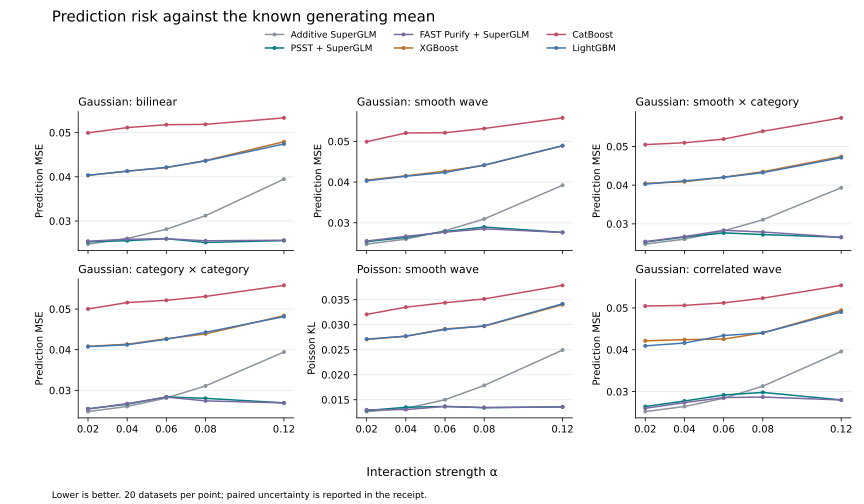

# Standalone XGBoost, CatBoost and LightGBM comparison

All three boosters have higher average test loss than additive SuperGLM and
the screened SuperGLM refits on this simulation grid. XGBoost and LightGBM
are close; CatBoost has higher error and takes longer under the chosen search.
The larger part of the gap is already present before adding interactions to
SuperGLM. This supports its use on these smooth additive data, without
establishing a general advantage over boosting or better interaction detection.

This extends the [PSST/FAST study](2026-09-psst-detection-study.md) with three
standalone gradient-boosted tree models. The question is whether their final
predictions outperform the additive SuperGLM baseline or the SuperGLM models
selected after interaction screening. This run does not rank GBM interactions
or measure their planted-pair recovery.

The [protocol](https://github.com/StrudelDoodleS/superglm/blob/9b325f35586a5ae60a7c3fc3f559f26a1a64c953/benchmarks/psst_booster_protocol.md) fixed the data and
search settings before the main booster results. Each library uses all 600
previously selected prediction datasets, covering six cases, five strengths
and 20 replicates. Training, validation and test sizes remain 4,000, 2,000
and 8,000. Dataset IDs and generator hashes bind the comparison to the earlier
SuperGLM results.

## Prediction results

All 1,800 library/dataset evaluations and 5,400 candidate fits completed
without failures or recorded warnings. Every selected model was a booster;
validation never chose the intercept fallback. Gaussian averages cover 500
matched datasets across five cases; Poisson averages cover 100 in one case.
Lower loss is better within each column.

| Model | Gaussian test MSE | Poisson test NLL |
| --- | ---: | ---: |
| Additive SuperGLM | 1.02540 | 0.66751 |
| PSST + SuperGLM | 1.02238 | 0.66446 |
| FAST default + SuperGLM | 1.02228 | 0.66453 |
| FAST Purify + SuperGLM | 1.02233 | 0.66441 |
| XGBoost | 1.03977 | 0.68032 |
| CatBoost | 1.04930 | 0.68536 |
| LightGBM | 1.03969 | 0.68037 |

The following paired differences subtract PSST + SuperGLM from each booster.
Brackets give 95% bootstrap intervals using 20 joint replicate blocks. They
describe uncertainty across these simulation replicates, not across possible
applications. Each booster's interval is above zero in both families.

| Booster | Gaussian MSE difference [95% interval] | Poisson NLL difference [95% interval] |
| --- | ---: | ---: |
| XGBoost | +0.01739 [0.01549, 0.01939] | +0.01587 [0.01522, 0.01656] |
| CatBoost | +0.02692 [0.02461, 0.02915] | +0.02091 [0.01963, 0.02220] |
| LightGBM | +0.01732 [0.01540, 0.01935] | +0.01591 [0.01528, 0.01660] |

On individual Gaussian datasets, XGBoost has lower observed loss than PSST
on 3/500, CatBoost on 1/500 and LightGBM on 3/500. None does on the 100
Poisson datasets. These are descriptive counts; shared seeds make a binomial
interpretation inappropriate. The FAST-versus-PSST intervals include zero
in both families, so this extension does not separate the two screeners.

Risk against the known generating mean shows the same pattern. All three
boosters have higher average risk than PSST in each of the 30 case/strength
cells. The additive baseline's risk rises with interaction strength, while
the screened refits recover much of that increase. These curves average
20 datasets per point; per-cell paired intervals are in the
[receipt](https://github.com/StrudelDoodleS/superglm/blob/master/benchmarks/psst_booster_receipt.json).



## Fitting and selection

XGBoost CPU 3.4.1, CatBoost 1.2.10 and LightGBM 4.7.0 each search depths
2, 4 and 6, with learning rate 0.05, up to 1,000 boosting rounds and
40-round validation early stopping. Validation chooses among the three
candidate fits and a training-fitted intercept. Depth and boosting iteration
are fixed before generating or evaluating the test observations.

All libraries receive native categorical features. The category vocabulary
comes from training inputs. Gaussian fits use squared-error objectives and
Poisson fits use Poisson objectives. The benchmark converts raw Poisson
predictions to means once, then applies the same loss functions to every
model. The
[XGBoost prediction interface](https://xgboost.readthedocs.io/en/stable/prediction.html)
needs an explicit best-iteration range; the runner supplies it.
[CatBoost's prediction scale](https://catboost.ai/docs/en/concepts/python-reference_catboostregressor_predict)
also depends on the objective, so the runner requests raw values explicitly.

LightGBM sets its leaf limit to `2**depth` as well as setting maximum depth.
CatBoost retains its native categorical statistics and symmetric CPU trees.
Other regularization and sampling settings use library defaults. Equal
depth menus do not equate the different models' capacity, and validation
early stopping searches more than three possible predictors. This is a
bounded tuning comparison, not an equal-compute experiment or an exhaustive
search for the best configuration of each library.

XGBoost selected depth 2 on 596/600 datasets and depth 4 on four. LightGBM
selected depth 2 on 597 and depth 4 on three. CatBoost selected depths 2, 4
and 6 on 295, 205 and 100 datasets. Selected best iterations reached the
1,000-round boundary on 21 XGBoost, 11 CatBoost and 24 LightGBM datasets.
Across all 1,800 candidates per library, 81 XGBoost, 64 CatBoost and 78 LightGBM fits
reached that training limit. The cap therefore constrains some searches;
this run cannot tell whether more rounds would improve their test results.

## Time and memory

The main run took 1,448 seconds, about 24 minutes, with eight concurrent
jobs. That wall-clock total was observed in the run log and is not recorded
in the committed receipt; summed job times exclude interpreter startup and
cannot reconstruct it. The table gives medians over all 600 jobs per library. Tuning includes
all three depth candidates, preprocessing and validation predictions. Test
prediction uses 8,000 observations.

| Library | Tuning seconds | Test prediction seconds | Process peak RSS, MiB | Selected boosting rounds |
| --- | ---: | ---: | ---: | ---: |
| XGBoost | 0.70 | 0.045 | 372 | 441 |
| CatBoost | 8.44 | 0.009 | 509 | 517.5 |
| LightGBM | 0.66 | 0.110 | 366 | 437 |

Maximum process peak RSS was 376 MiB for XGBoost, 535 MiB for CatBoost and
372 MiB for LightGBM. These fresh-process measurements include imports and
all retained candidates. The wall time also includes worker startup and
data generation. Neither the sizes nor the process lifetimes match the
10-million-row SuperGLM benchmark, so these values do not answer its memory
scaling question.

## Measurements and uncertainty

Observed test loss measures prediction on noisy outcomes. For Gaussian
outcomes it is MSE. For Poisson outcomes it is mean negative log likelihood
without the outcome-only log-factorial, which cancels in paired comparisons.

The simulation also knows the generating conditional mean. Prediction risk
against that mean removes outcome noise from this diagnostic. Its units are
Gaussian MSE and Poisson KL divergence, respectively. Gaussian noise has
variance one, so a large relative difference in mean-prediction risk can
correspond to a small relative difference in observed test MSE.

Every comparison is paired by dataset ID. Per-case averages cover all five
strengths. Bootstrap samples keep every case with the same replicate ID
together, including independent and correlated designs in the Gaussian
aggregate. This accounts for shared fitting seeds as well as shared data
seeds. There are 20 independent replicate blocks, not 500 independent
Gaussian comparisons. Intervals are exploratory and pointwise.

Each library/dataset job runs in a fresh spawned process. Tuning time
includes preprocessing, all three fits and validation predictions. Process
peak RSS includes imports and retained search models; test prediction time
is separate. Eight jobs run concurrently with one native computation thread
each. Earlier SuperGLM RSS values came from reused workers and do not provide
an equivalent per-job memory baseline.

Failed candidate fits remain recorded and unavailable to validation. A
selected model's test failure remains a failed evaluation and cannot trigger
a different selection. The receipt reports planned and measured denominators,
candidate failures and any all-candidate fallback to the intercept.

## Scope

These generators have smooth additive effects, balanced categorical levels,
30 input features and one weak pairwise interaction. They are favorable to
the structure SuperGLM models explicitly. The six cases do not establish a
general ranking for tabular learning, sparse-count insurance data, sharp
steps, rare or unseen categories, or higher-order interactions.

The experiment also does not identify the cause of every prediction gap.
Basis choice, regularization, tree structure and the bounded tuning search
can all matter. Changing settings after observing these outcomes would
require a separate evaluation on fresh data.

## Reproduction

The runner and analysis are
[psst_booster_study.py](https://github.com/StrudelDoodleS/superglm/blob/9b325f35586a5ae60a7c3fc3f559f26a1a64c953/benchmarks/psst_booster_study.py) and
[psst_booster_analysis.py](https://github.com/StrudelDoodleS/superglm/blob/master/benchmarks/psst_booster_analysis.py).
The earlier study's raw records must be present before running the paired
analysis; its report gives their reproduction commands.

The [receipt](https://github.com/StrudelDoodleS/superglm/blob/master/benchmarks/psst_booster_receipt.json) records source and
raw-input hashes, execution summaries and all matched comparisons. SuperGLM
numerical source matches revision
`22662a09c612f5fa9b5eb364e07ec8f8ac0a0d21` from the earlier study. The booster
manifest records NumPy 2.5.2 and pandas 3.0.5. It did not record that run's
Python version or platform; the earlier PSST manifest cannot establish them.

Before joining the reference results, the analysis checks the FAST manifest
against PSST's simulation and runtime settings, and checks FAST's wrapper,
protocol, method mapping and InterpretML version. The receipt includes both
reference manifests, FAST's metadata and their file hashes.

Adapter tests compare response predictions with each library's native
interface for both objectives. An early-stopped XGBoost fixture verifies that
prediction excludes trees beyond the chosen iteration; substituting all-tree
prediction makes that regression fail. Analysis tests cover dataset joins,
retention of failed evaluations and resampling shared seeds together.
The combined PSST, FAST and booster benchmark suite passes 32 tests. Ruff,
formatting, lock consistency and installed-package compatibility checks pass.

```bash
uv sync --python 3.13 --extra dev
uv pip install xgboost-cpu==3.4.1 catboost==1.2.10 lightgbm==4.7.0
export OPENBLAS_NUM_THREADS=1 OMP_NUM_THREADS=1 NUMBA_NUM_THREADS=1
PSST_BOOSTER_RUN=.benchmark-artifacts/psst-booster-replay

uv run --no-sync python benchmarks/psst_booster_study.py \
  --phase pilot --output "$PSST_BOOSTER_RUN"
uv run --no-sync python benchmarks/psst_booster_study.py \
  --phase study --workers 8 --output "$PSST_BOOSTER_RUN"
uv run --no-sync python benchmarks/psst_booster_analysis.py \
  --input "$PSST_BOOSTER_RUN" \
  --reference .benchmark-artifacts/psst-detection-study
```

Use a fresh output directory when code or settings change. The initial
engineering pilot exposed a pandas string-dtype assumption in the benchmark
adapter. Its outputs are excluded. The corrected pilot covers all six cases
for all three libraries. No production SuperGLM code changes are part of
this comparison.
