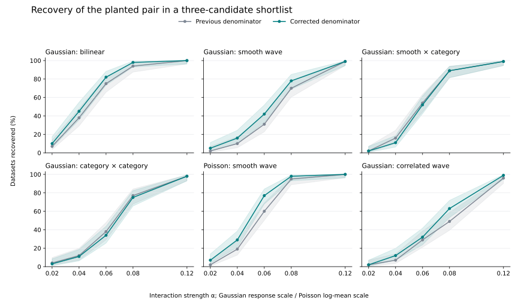
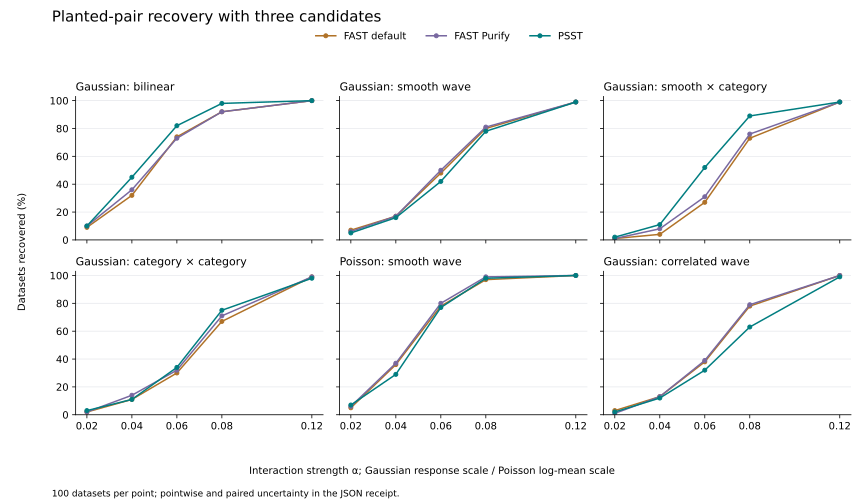

# PSST detection and fixed-budget refits

The variance correction improves average recovery on this simulation grid,
with a tradeoff between interaction kinds. Corrected PSST and FAST Purify
have similar overall recovery, with different strengths by case. Neither
comparison establishes a general increase in predictive accuracy.

All results use SuperGLM source revision
`22662a09c612f5fa9b5eb364e07ec8f8ac0a0d21`. This experiment changes no production
code. The [normalization protocol](https://github.com/StrudelDoodleS/superglm/blob/f6a27ff3bb36c76267158191b590ef82236e56f8/benchmarks/psst_detection_protocol.md)
was written before the final run. The
[FAST supplement](https://github.com/StrudelDoodleS/superglm/blob/f6a27ff3bb36c76267158191b590ef82236e56f8/benchmarks/psst_fast_protocol.md) was written after
the normalization study and before observing FAST results.

## What the experiment asks

There are 30 features and 435 possible pairs. Exactly one pair contributes an
interaction to the generating model. The primary measure is how often a
screener puts that pair in a shortlist of three. Randomly choosing three
distinct pairs would recover it with probability `3/435`, about 0.69%.

The six cases are Gaussian bilinear, Gaussian smooth wave, Gaussian smooth
by category, Gaussian category by category, Poisson smooth wave, and Gaussian
smooth wave with correlated substitute features. Each case has five signal
strengths and 100 datasets per strength, giving 3,000 signal datasets.
There are another 900 independent null datasets for cutoff calibration and
audit. Each fit uses 4,000 training observations.

On the first 20 datasets of every signal cell, each screener gets three
single-interaction refits. Validation on 2,000 observations selects among
those candidates and the additive baseline. The winner is fixed before
evaluating 8,000 independent test observations. This measures the usefulness
of a shortlist when fitting is expensive. It does not evaluate jointly adding
all three interactions.

Alongside observed test loss, the simulation measures prediction error
against the known generating mean. Gaussian risk is mean squared error.
Poisson risk is mean Poisson KL divergence. These units are kept separate.

For the correlated case, recovery means finding the named generating pair.
A correlated substitute can still improve prediction, so a missed named pair
does not automatically mean a useless recommendation.

## What the variance correction changes

Both normalizations use the same candidate statistics and all penalty rungs.
Each chooses its own winning rung. The only difference is the denominator:
the previous `sqrt(2*edf)` versus the corrected Gaussian-reference standard
deviation. Every corrected score matches the public screen exactly. The
excluded pilot also checks the previous scores against an actual public
screen with the previous denominator substituted.

| Case | Previous top-three recovery | Corrected recovery |
| --- | ---: | ---: |
| Gaussian bilinear | 62.8% | 67.0% |
| Gaussian smooth wave | 42.4% | 48.0% |
| Gaussian smooth by category | 52.0% | 50.6% |
| Gaussian category by category | 45.8% | 44.2% |
| Poisson smooth wave | 55.2% | 62.2% |
| Gaussian correlated wave | 36.6% | 41.6% |
| Equal-weight study average | 49.13% | 52.27% |

The average rises from 1,474 to 1,568 recoveries out of 3,000. The paired
increase is 3.13 percentage points, with a 95% clustered bootstrap interval
of 2.50 to 3.80 points. The bootstrap clusters cases that share simulation
seeds. This average describes these fixed cases and strengths, rather than
an estimated distribution of real applications.



There are 110 datasets where the correction recovers the pair and the old
normalization misses it, and 16 with the opposite outcome. The categorical
losses involve competing penalized pairs entering the shortlist. Correct
reference variance does not make all candidate kinds have identical tails
after penalty-rung selection.

The shortlist changes on 1,252 datasets, but the final validation-selected
model changes on only 28 of the 600 refit evaluations. Prediction results
therefore need more restraint than the ranking result. The small per-cell
prediction samples do not establish a broad predictive improvement. The
[prediction figure](figures/2026-09-psst-prediction-gain.svg) shows those
differences and their paired intervals.

## Detection and false alarms

Each method gets its own cutoff from 200 separate null datasets for each
design. The cutoff includes maximization over all candidate pairs and, for
PSST, all penalty rungs. A separate 100-dataset audit checks any-pair false
alarms. No audit outcome changes a cutoff.

The normalization audit produces these counts out of 100:

| Null design | Previous | Corrected |
| --- | ---: | ---: |
| Independent Gaussian | 4 | 6 |
| Independent Poisson | 5 | 4 |
| Correlated Gaussian | 3 | 2 |

These cutoffs target a common 5% any-pair false-alarm rate. The audit is too
small to certify closely matched achieved rates. Detection intervals in the
receipt include uncertainty from both calibration and evaluation samples.
These are empirical comparisons of the entire procedure on these generators,
not a new public p-value interpretation for the PSST score.

## Which external comparison answers the question

InterpretML's
[`measure_interactions`](https://interpret.ml/docs/python/api/measure_interactions.html)
is the direct FAST comparator. Both its default and native Purify variants
receive the same fitted SuperGLM additive model's link-scale predictions,
all 435 candidate pairs, and an explicit matching Gaussian or Poisson
objective. Both retain the public default binning and split settings.

The public wrapper does not expose Purify. The benchmark instruments the
installed native flag in InterpretML 0.7.8 and verifies every native call.
Purify removes main contributions within the candidate's partition. It is
not the same nuisance projection as PSST. Native FAST can return a finite
negative sentinel on numerical failure, so analysis also checks every gain
is nonnegative.

FAST and PSST then receive identical SuperGLM refit and validation budgets.
Each gets its own null cutoff. Raw FAST strength and PSST score magnitudes
are never compared directly. This tests which screen supplies better pairs
to SuperGLM.

| Case | FAST default | FAST Purify | Corrected PSST |
| --- | ---: | ---: | ---: |
| Gaussian bilinear | 61.4% | 62.2% | 67.0% |
| Gaussian smooth wave | 50.2% | 50.6% | 48.0% |
| Gaussian smooth by category | 40.8% | 43.0% | 50.6% |
| Gaussian category by category | 41.8% | 43.6% | 44.2% |
| Poisson smooth wave | 63.2% | 64.4% | 62.2% |
| Gaussian correlated wave | 46.4% | 46.4% | 41.6% |
| Equal-weight study average | 50.63% | 51.70% | 52.27% |

These are top-three recovery rates over all five fixed strengths. PSST's
paired average difference from default FAST is 1.63 percentage points, with
a clustered 95% interval of 0.47 to 2.77 points. Its difference from Purify is
0.57 points, with an interval of -0.57 to 1.70 points. The latter does not
clearly separate the methods. The case differences are more informative
than a claim of universal superiority.



The FAST false-alarm audits give these counts out of 100, alongside PSST:

| Null design | FAST default | FAST Purify | PSST |
| --- | ---: | ---: | ---: |
| Independent Gaussian | 6 | 8 | 6 |
| Independent Poisson | 3 | 3 | 4 |
| Correlated Gaussian | 1 | 1 | 2 |

The wider uncertainty from finite calibration remains relevant here. The
[calibrated detection figure](figures/2026-09-psst-fast-detection.svg) shows
planted-pair threshold crossings separately from top-three recovery.

All 600 planned predictive comparisons are measured for each FAST variant.
The following descriptive averages show risk reduction from the additive
baseline, multiplied by 1,000 for readability. Each row averages the five
strengths and 20 datasets per strength. The receipts contain the per-cell
paired intervals; these averages do not establish a predictive winner.

| Case | Risk unit | FAST default | FAST Purify | PSST |
| --- | --- | ---: | ---: | ---: |
| Gaussian bilinear | MSE | 4.254 | 4.237 | 4.420 |
| Gaussian smooth wave | MSE | 2.563 | 2.588 | 2.559 |
| Gaussian smooth by category | MSE | 2.748 | 2.908 | 3.217 |
| Gaussian category by category | MSE | 2.924 | 2.933 | 2.814 |
| Poisson smooth wave | Poisson KL | 3.292 | 3.407 | 3.345 |
| Gaussian correlated wave | MSE | 2.585 | 2.460 | 1.955 |

A full EBM or GBM comparison would answer a broader predictive question.
That experiment should allow each model its own fitting procedure and
validation tuning, then compare independent test loss, complete training
time, peak memory and model complexity. It would not isolate the screener.

## What would block 100% recovery

Near-perfect recovery is a useful target for strong, identifiable signals.
Corrected PSST already recovers 100 of 100 datasets for the strongest
bilinear and Poisson cases in this grid. That observation is not a guarantee
for new datasets.

At weaker strengths, finite-sample noise can make a false pair look better
than the planted one. Correlated substitutes compete for a small shortlist.
More compute cannot guarantee recovery of information the sample does not
reliably distinguish.

Representation is another possible limit. Detection depends on how much of
the interaction the candidate basis represents and how the penalty weights
those directions. This study does not
establish that basis width is the dominant remaining obstacle. A wider basis
can admit more noise and costs more computation, as the
[mgcv basis-dimension guidance](https://stat.ethz.ch/R-manual/R-devel/library/mgcv/html/choose.k.html)
explains. Separate ablations would be needed to attribute a missed detection
to the representation, the penalty ladder, or the ranking approximation.

A useful improvement would recover weaker interactions at the same sample
size, false-alarm target and refit budget, while improving prediction after
validation. Raising recovery by always returning more pairs would spend a
different budget.

## Limits and failures

Numeric features take 41 equally likely values, categorical levels are
balanced, and the planted interactions are bilinear or smooth. The study
omits sharp steps, rare levels, continuous-support scaling, other sample
sizes and sparse-count insurance settings. PSST uses its exact dense route
throughout. The Poisson generator has log mean `0.5 + additive + interaction`.
It does not resemble every frequency dataset.

Two of the 3,900 baseline fits exceed the default 20 REML iterations. They
remain in the primary result as missed recoveries. Separate diagnostic fits
converge at 21 and 30 iterations when given a larger limit. Their replacement
outcomes do not enter the study. There are no candidate-refit or test
evaluation failures in the normalization run; all 600 planned prediction
evaluations are measured.

The FAST run encounters the same two baseline failures. Five of its 2,142
unique candidate refits also reach the 20-iteration limit. The fixed failure
rule makes those candidates unavailable to validation; all datasets remain
in the study. No selected test evaluation fails. The 2,916 metrics available
for shared baseline or candidate fits match exactly across the two runs.
All 3,391,260 recorded FAST scores are finite and nonnegative.

Six worker processes use one BLAS, OpenMP and Numba thread each. The PSST
run takes 940 seconds and the FAST run 744 seconds. The runs include different
unions of candidate refits. Median screening time is 0.537 seconds for one
PSST screen with both normalizations computed, and 0.122 seconds for both
FAST variants together. FAST has lower observed screening cost in this setup.
These instrumented concurrent measurements do not establish a portable
speed ratio. Maximum recorded worker peak RSS is 376 MiB for PSST and
384 MiB for FAST; neither is the combined peak across six workers.

All per-cell intervals are pointwise. The 20 predictive replicates per cell
are exploratory. A zero-width bootstrap interval when no selections change
does not establish equivalence. This follows the separation of design,
estimands and Monte Carlo uncertainty described by
[Morris, White and Crowther](https://pmc.ncbi.nlm.nih.gov/articles/PMC6492164/).

## Reproducing and reviewing the result

The [normalization receipt](https://github.com/StrudelDoodleS/superglm/blob/f6a27ff3bb36c76267158191b590ef82236e56f8/benchmarks/psst_detection_receipt.json) and
[FAST receipt](https://github.com/StrudelDoodleS/superglm/blob/f6a27ff3bb36c76267158191b590ef82236e56f8/benchmarks/psst_fast_receipt.json) contain manifests,
source hashes, raw-record hashes, all cell summaries and uncertainty
calculations. Raw records remain in the ignored local directory
`.benchmark-artifacts/psst-detection-study/`, under `final/` and `fast-final/`.
The earlier engineering records and all pilots are excluded.

Use a fresh output directory when replaying. The benchmark was run on Linux
with Python 3.13.14, NumPy 2.5.2 and SciPy 1.18.0. InterpretML is an optional
benchmark dependency and does not change the project's lockfile.

```bash
uv sync --python 3.13 --extra dev
uv pip install --no-deps interpret-core==0.7.8
export OPENBLAS_NUM_THREADS=1 OMP_NUM_THREADS=1 NUMBA_NUM_THREADS=1
PSST_STUDY_RUN=.benchmark-artifacts/psst-detection-replay

uv run --no-sync python benchmarks/psst_detection_study.py \
  --phase pilot --output "$PSST_STUDY_RUN/psst"
uv run --no-sync python benchmarks/psst_detection_study.py \
  --phase study --workers 6 --output "$PSST_STUDY_RUN/psst"
uv run --no-sync python benchmarks/psst_detection_analysis.py \
  --input "$PSST_STUDY_RUN/psst" --output "$PSST_STUDY_RUN/psst/analysis"

uv run --no-sync python benchmarks/psst_fast_comparison.py \
  --phase pilot --output "$PSST_STUDY_RUN/fast"
uv run --no-sync python benchmarks/psst_fast_comparison.py \
  --phase study --workers 6 --output "$PSST_STUDY_RUN/fast"
uv run --no-sync python benchmarks/psst_fast_analysis.py \
  --psst "$PSST_STUDY_RUN/psst" --fast "$PSST_STUDY_RUN/fast" \
  --output "$PSST_STUDY_RUN/fast/analysis"
```

The 20 focused benchmark tests pass, as do Ruff checks, lockfile validation
and installed dependency checks. The regressions detect mutations that force
the first penalty rung, skip cutoff resampling, or accept finite negative
native FAST failures. Independent review covered the study design,
failure handling, FAST objectives and native flags, pairing, calibration,
uncertainty calculations and shared-fit replay.

The next comparison should add independently specified signal shapes and
fresh seeds, particularly steps, correlated alternatives and sparse counts.
The present results identify useful targets for that study, but do not
justify tuning a combined screener on these evaluation outcomes and claiming
its performance on the same datasets.
