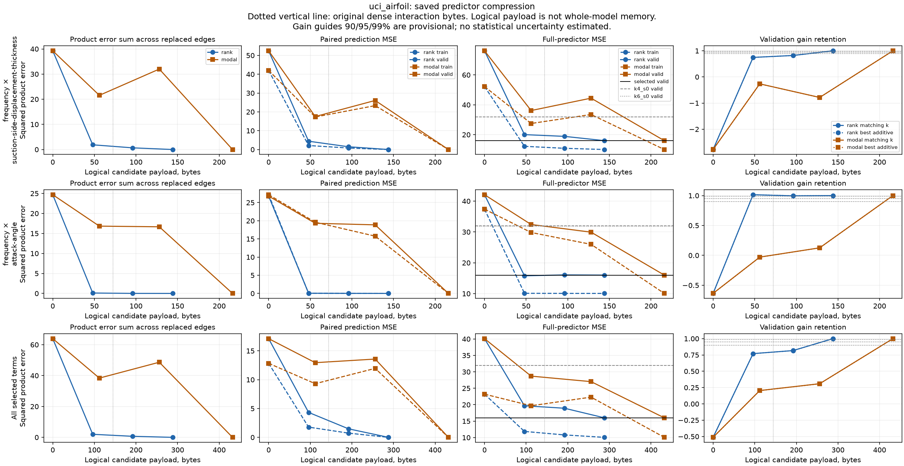
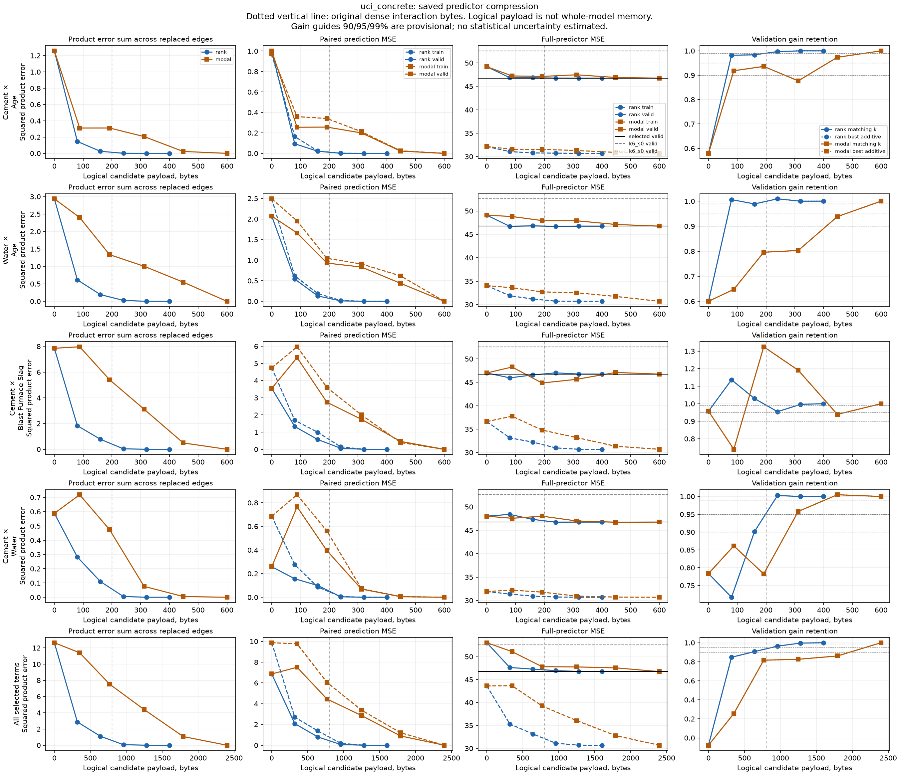
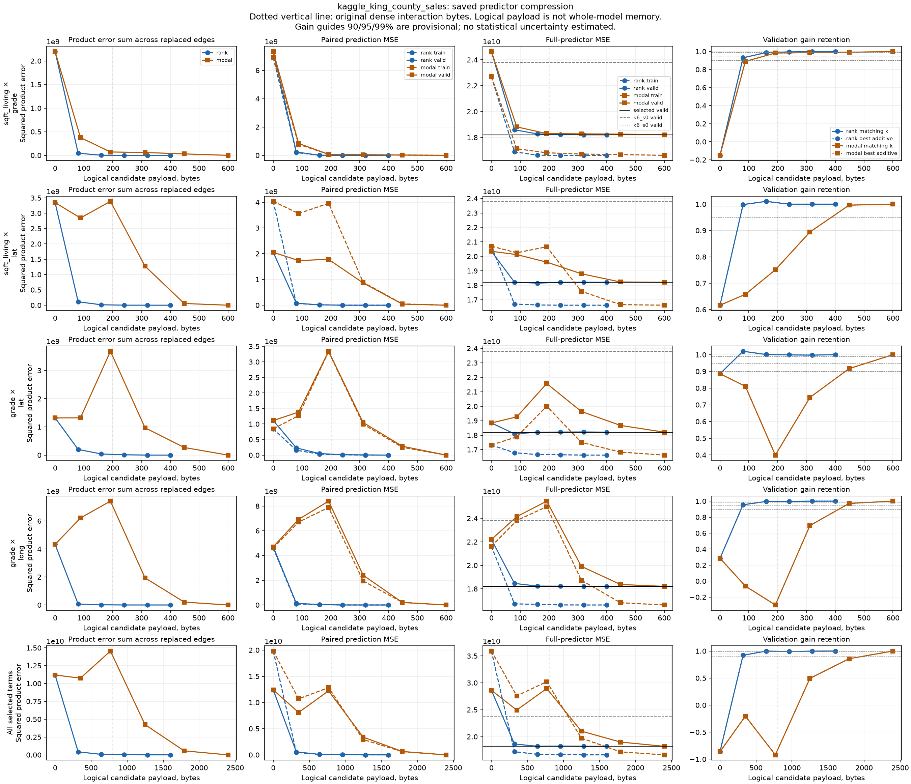

# Saved-model interaction compressibility pilot

Executed on 2026-09-20 from commit 1b8ac91f8d33ef1544a6029484385c7e02d5c9a4.
The three saved cases completed all 144 requested attempts with no refusals,
new model fits or fresh test evaluation. The pilot changes no production code
under src/superglm and no dependency or version files.

King County is the strongest result. Common rank 2 uses 80 factor entries
instead of 100 dense interaction coefficients and retains 99.8745% of the
validation gain over the saved additive model. Concrete retains 90.679% at the
same 20% entry reduction. Airfoil's smaller common rank-1 representation retains
77.007%. Only King County crosses 95% with fewer entries on the common-rank
menu. Individual-term results differ; we did not sweep mixed per-edge budgets.

The penalty-mode prefixes performed worse at comparable logical sizes. All
three cases need the full common prefix to cross the 90%, 95% or 99% guides.
With the required mode columns counted, those full prefixes cost three times
the dense interaction coefficient payload.

## Evidence and saved controls

The [compact measurements](2026-09-14-interaction-compressibility-measurements.json)
preserve every curve point, refusal/count field, identity, cost, storage measure
and raw receipt/array hash. The root column lists describe its attempt and
per-term result tables. Detailed arithmetic dictionaries and vectors remain in
the hashed raw JSON/NPZ under
.benchmark-artifacts/interaction-compressibility/pilot-20260920/.
The raw measurements.json SHA-256 is
08bd32de5964fe566a3763bbc5223989bf7775aafce82a74c454187a3fca4ebf.

Each worker admitted frozen source/runtime, input bytes and saved model hashes,
then exactly replayed its selected and additive validation losses. The source
archive is /home/max/projects/superglm/.worktrees/adaptive-interactions.
NPZ evidence includes actual train/validation row identities, outcomes, weights,
inputs, bases, reference effects, candidate matrices, complete predictions and
rowwise arithmetic allowances. The old test designation remains already-used
development data. No test partition was evaluated.

| Case | Saved selection | Train / valid rows | Terms and shape | Dense entries | Selected valid MSE | Matching-k additive MSE | Best additive MSE |
| --- | --- | ---: | --- | ---: | ---: | ---: | ---: |
| Airfoil | k4_s2 | 900 / 284 | 2, 3 × 3 | 18 | 16.007143904202543 | 31.946987722794155, k4 | 31.936129226125153, k6 |
| Concrete | k6_s4 | 643 / 173 | 4, 5 × 5 | 100 | 46.745850384190284 | 52.584971723403214, k6 | same |
| King County | k6_s4 | 13738 / 3083 | 4, 5 × 5 | 100 | 18208128400.631866 | 23800707774.09343, k6 | same |

Airfoil has 12 rank and 12 modal attempts. Concrete and King County each have
30 of each. Every menu includes zero and full budgets, each selected term
alone, and all selected terms together.

## Size and validation gain

Retention is (additive loss − candidate loss) / (additive loss − selected loss).
The table uses the validation-best additive control. Airfoil's matching-k
retention at common rank 1 is 77.02297%, versus 77.00730% against its best k6
additive. Both controls' complete train/validation ratios are in the measurements.

Logical rank bytes are 8*r*(p+q) per term. Modal logical bytes include the
selected products and needed columns of both frozen mode bases. Rank factors
are payload estimates, not allocated/exported factor arrays or deployed models.
Expanded candidate matrices, full frozen bases and prediction/allowance arrays
are charged as diagnostic storage separately.

| Case and common menu | First budget / bytes at 90% | At 95% | At 99% | Original dense bytes |
| --- | --- | --- | --- | ---: |
| Airfoil rank | 3 / 288 | 3 / 288 | 3 / 288 | 144 |
| Airfoil modal | 3 / 432 | 3 / 432 | 3 / 432 | 144 |
| Concrete rank | 2 / 640 | 3 / 960 | 4 / 1280 | 800 |
| Concrete modal | 5 / 2400 | 5 / 2400 | 5 / 2400 | 800 |
| King County rank | 1 / 320 | 2 / 640 | 2 / 640 | 800 |
| King County modal | 5 / 2400 | 5 / 2400 | 5 / 2400 | 800 |

The next table shows each term's first 95% budget / logical bytes, with all
other terms retained at their saved values. Full 90/95/99 comparisons can be
derived from the complete curve tables.

| Case / replaced term | Rank at 95% | Modal at 95% |
| --- | --- | --- |
| Airfoil, frequency × displacement thickness | 3 / 144 | 3 / 216 |
| Airfoil, frequency × attack angle | 1 / 48 | 3 / 216 |
| Concrete, Cement × Age | 1 / 80 | 4 / 448 |
| Concrete, Water × Age | 1 / 80 | 5 / 600 |
| Concrete, Cement × Blast Furnace Slag | 0 / 0 | 0 / 0 |
| Concrete, Cement × Water | 3 / 240 | 3 / 312 |
| King County, sqft_living × grade | 2 / 160 | 2 / 192 |
| King County, sqft_living × lat | 1 / 80 | 4 / 448 |
| King County, grade × lat | 1 / 80 | 5 / 600 |
| King County, grade × long | 1 / 80 | 4 / 448 |

## Adverse and nonmonotone outcomes

All common rank-zero predictors are worse than their separately saved additive
controls. They retain the jointly fitted mains/intercept and are not additive
refits. Their validation MSEs are 40.10771, 53.03632 and 28625136634.30.
In Airfoil, removing only frequency × displacement thickness gives MSE
76.16334, much worse than removing both selected interactions.

King County's common rank 3 reduces product and paired error further than rank
2, but its validation MSE rises from 18215145086.88 to 18258100946.28. Modal
prefix 2 increases product error over prefix 1 in Airfoil, from 38.3722 to
48.6548, and in King County, from 10.7529 to 14.5536 billion. King County's
common prefix 2 retains −92.0380% of the additive gain and performs worse than
removing all selected interactions. Larger budgets need not improve loss.

Across all attempts, 17 Airfoil, 41 Concrete and 45 King County candidates have
validation loss above the reference beyond the estimated arithmetic bands.
Respectively 9, 2 and 8 are worse than the best additive control beyond the
candidate-gain bands. Rank/modal zero-budget attempts count separately.

Some individual replacements improve development validation loss. Airfoil's
rank-1 frequency × attack-angle replacement retains 101.4684%; Concrete's
modal prefix-2 Cement × Blast Furnace Slag reaches 132.4743%; King County's
rank-1 grade × lat reaches 102.0669%. These retrospective observations do not
establish better generalization. Ratios remain raw and unclamped.

Every term and aggregate curve appears below. Product errors, paired
train/validation errors, full-predictor losses and both additive-control ratios
occupy separate panels. The dotted vertical line marks dense coefficient bytes.
All adverse results remain visible; there were no metric or candidate refusals.

## Numerical meaning and verification

For normalized training weights a_i, the exact product-metric identity is

    sum_i sum_j a_i a_j (b_left[i]^T (C-C_r) b_right[j])^2
      = ||L (C-C_r) R^T||_F^2,
    L^T L = sum_i a_i b_left[i] b_left[i]^T,
    R^T R = sum_j a_j b_right[j] b_right[j]^T.

The SVD tail is the best fixed-target rank residual in the whitened product
metric in exact arithmetic. Computed tails, realized errors and their
estimated discrepancy allowances are separate numerical diagnostics. Paired
rows use the joint data distribution; simultaneous replacements have cross
terms. Neither paired error nor full-predictor loss equals a sum of edge
product errors in general.

All training QR metrics and frozen penalty-mode bases were admitted. Marginal
factor conditions ranged from 3.06 to 49.32. Estimated relative product-metric
discrepancies ranged from 2.55e-12 to 3.66e-10. Each penalty margin had one
numerically ambiguous zero eigenvalue and no unresolved internal cutoff.
This does not certify nullity.

Each predictor copies the complete saved reference and applies ordered
interaction deltas. The supplied numerical design accounts for contractions,
runtime discrepancies, update rounding and full-budget coefficient errors.
All 26 full-budget attempts passed in both partitions. Maximum absolute loss
differences were 3.553e-15, 7.105e-15 and 3.815e-6; the maximum corresponding
loss allowances were 2.154e-10, 1.453e-10 and 7.774.

All 576 partition/control gain ratios passed denominator admission. No
90/95/99 guide lay inside an estimated ratio band; guide tables require R−B_R
to clear the guide. These are provisional engineering guides, not tolerances
or significance thresholds. Intervals are estimated, not certified or
statistical. No sampling or selection uncertainty was estimated, and the
later P1/P2/P3 proof and arithmetic obligations remain open.

The controller independently replayed the raw evidence using only the standard
library and NumPy: 307 file hashes, 14 saved reference/control losses, 288
candidate losses, 288 predictor replacements, 52 full-budget replays and all
144 attempt/storage records passed. It viewed all three figures. The ignored
task workspace retains independent_replay.py and its ledger.md transcript.

The implementer demonstrated RED/GREEN coverage and a large-base arithmetic
mutation failure, then passed 94 pilot tests and the last three affected
checks. The controller subsequently ran both pilot suites plus the broad
interaction/data and housing-owner suites: 159 tests passed in 8.99 seconds.
Four-file Ruff/format and diff checks passed. Live pilot/manifest and frozen
source/input hashes match; the source archive is clean. No full production
suite rerun is claimed.

## Cost and next decision

The batch completed in 17.3991 seconds, including plots/export, from
11:45:18.919167 to 11:45:36.318232 UTC. All serial one-thread child processes
returned zero, within their 180-second limits and the 900-second batch cap.

| Case | Diagnostic process seconds | Worker seconds | High-water RSS MiB | Historical selected fit seconds |
| --- | ---: | ---: | ---: | ---: |
| Airfoil | 3.0764 | 2.0926 | 362.543 | 0.375949 |
| Concrete | 3.4294 | 2.4801 | 365.742 | 1.064220 |
| King County | 5.7897 | 4.8405 | 409.266 | 2.368171 |

Historical fit timings are context only; no fitting speedup was measured.
Dense interaction coefficients occupy only 144/800/800 bytes, or
0.0500%/0.0614%/0.0122% of historical retained model owner payloads
288143/1303068/6539792 bytes. Coefficient compression alone offers negligible
whole-model memory savings here. Live retained payloads after loading/replay
were 316180/1780680/7611944 bytes; shared diagnostic arrays were
303920/454752/12653712 bytes. These are separate accounting scopes.

The next gate remains a separately bounded acquisition of a verified wide
California housing coefficient snapshot. None was usable in the known housing
artifacts. These tiny k4/k6 cases cannot establish rich-interaction scaling.
If the wider diagnostic supports low rank, write a direct-fit specification
that reduces tensor design/cache work and compare complete-fit time, memory,
numerical outputs and actual backend dispatch. This pilot chooses no
production representation and establishes no cheap-fitting claim.
